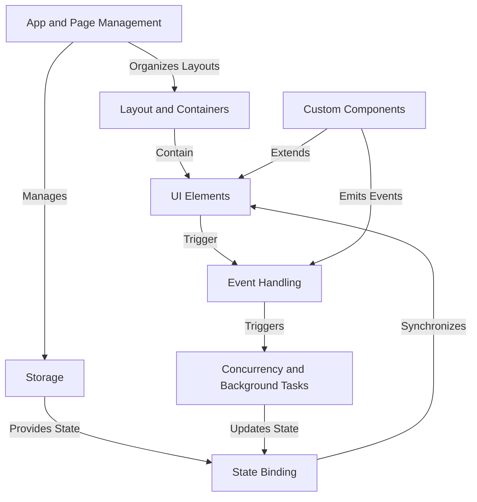

# Tutorial: nicegui

NiceGUI is a Python framework that lets you build **web-based graphical user interfaces** using *pure Python code*.
It provides visual *UI Elements* like buttons and inputs, ways to arrange them using *Layout and Containers*,
and mechanisms to respond to user actions through *Event Handling*.
It simplifies connecting Python data to the UI with *State Binding*, allows creating *Custom Components*,
manages the *App and Page* structure, handles slow tasks in the *Background* to keep the UI responsive, and offers *Storage* options for data persistence.

## Visual Overview

## Chapters

1. [App and Page Management
](01_app_and_page_management_.md)
2. [UI Elements
](02_ui_elements_.md)
3. [Layout and Containers
](03_layout_and_containers_.md)
4. [Event Handling
](04_event_handling_.md)
5. [State Binding
](05_state_binding_.md)
6. [Storage
](06_storage_.md)
7. [Concurrency and Background Tasks
](07_concurrency_and_background_tasks_.md)
8. [Custom Components
](08_custom_components_.md)

---

Generated by [AI Codebase Knowledge Builder](https://github.com/The-Pocket/Tutorial-Codebase-Knowledge).