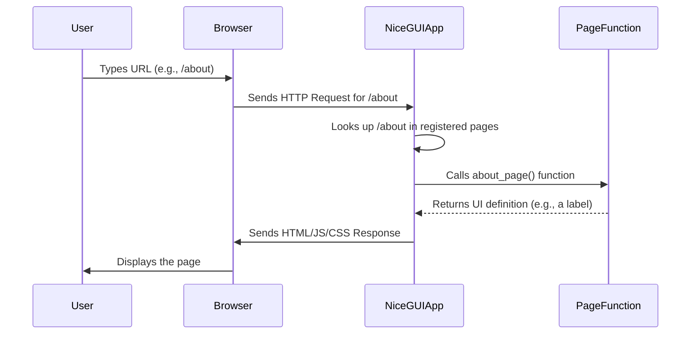

# Chapter 1: App and Page Management

Welcome to the first chapter of the NiceGUI tutorial! If you're looking to build interactive web applications using Python, you're in the right place. NiceGUI helps you do just that without needing to write HTML, CSS, or JavaScript.

In this chapter, we'll cover the absolute basics: how to get your NiceGUI application running and how to define different "pages" within it. Think of this as setting up the foundation and defining the main rooms of your web house.

### Starting Your Application with `ui.run()`

Every NiceGUI application needs a way to start. This is handled by the `ui.run()` function. When you call `ui.run()`, NiceGUI starts a small web server on your computer. This server listens for incoming requests from your web browser and sends back the content of your application's pages.

Let's start with the simplest possible NiceGUI app:

```python
from nicegui import ui

# We will add page content here later

ui.run() # This starts the NiceGUI web server
```

If you save this code as a Python file (e.g., `main.py`) and run it from your terminal using `python main.py`, you'll see some output indicating the server is starting, usually mentioning an address like `http://localhost:8000`.

```bash
# Expected terminal output (details might vary)
NiceGUI version ...
You can now open the intuitive web interface at http://localhost:8000
...
```

Open that address in your web browser, and you'll see a blank page. That's because we haven't added any content yet! The `ui.run()` function is essential – it's the switch that turns your Python script into a running web application.

### Defining Pages with `ui.page()`

Websites are usually more than just one screen; they have different pages for different purposes (like a home page, an about page, a contact page, etc.). In NiceGUI, you define these different screens or URLs using the `ui.page()` decorator.

A decorator is just a special Python syntax (using the `@` symbol) that modifies a function. The `@ui.page('/some_url')` decorator tells NiceGUI: "When someone visits the URL `/some_url` in their browser, run the Python function right below this decorator to build the content for that page."

The main page of your application is typically at the root URL, represented by a single slash `/`.

Let's add a home page to our empty app:

```python
from nicegui import ui

@ui.page('/') # This function will build the content for the URL '/'
def home_page():
    ui.label('Welcome to the Home Page!') # We'll learn about ui.label() in the next chapter!

ui.run()
```

Now, if you run this code and visit `http://localhost:8000`, you will see a page with the text "Welcome to the Home Page!".

We can easily add another page, for example, an "About" page at the URL `/about`:

```python
from nicegui import ui

@ui.page('/')
def home_page():
    ui.label('Welcome to the Home Page!')

@ui.page('/about') # This function will build the content for the URL '/about'
def about_page():
    ui.label('This is the About Page!')

ui.run()
```

Now, when you run this, visiting `http://localhost:8000` shows the home page, and visiting `http://localhost:8000/about` shows the about page. Each `@ui.page()` decorator essentially maps a URL path to a Python function that creates the user interface elements for that specific URL.

### Navigating Between Pages

Having different pages is great, but users need a way to move between them. NiceGUI provides `ui.navigate.to()` for this purpose. You can trigger this navigation from an interaction, like clicking a button.

Let's add buttons to navigate between our home and about pages:

```python
from nicegui import ui

@ui.page('/')
def home_page():
    ui.label('Welcome to the Home Page!')
    # Add a button that navigates to the '/about' page
    ui.button('Go to About', on_click=lambda: ui.navigate.to('/about'))

@ui.page('/about')
def about_page():
    ui.label('This is the About Page!')
    # Add a button that navigates back to the '/' page
    ui.button('Go to Home', on_click=lambda: ui.navigate.to('/'))

ui.run()
```

Now, running the app and visiting `http://localhost:8000` shows the home page with a "Go to About" button. Clicking it takes you to the about page, which has a "Go to Home" button to go back. This shows the basic flow of defining pages and enabling navigation.

### Organizing Pages with `APIRouter` (For Larger Apps)

As your application grows and you add many pages, putting all the `@ui.page()` definitions in a single file can become difficult to manage. This is where `APIRouter` comes in handy. It's a tool to group related pages and their routes together, often in separate files, making your project more organized.

`APIRouter` is borrowed from FastAPI, the underlying framework NiceGUI uses. It allows you to define a set of pages with a common *prefix* and then include that entire group into your main application.

Imagine you have a part of your app dedicated to user accounts. You might have pages like `/users/profile`, `/users/settings`, `/users/dashboard`. Instead of defining all of these with `@ui.page('/users/...')` in your main file, you can create an `APIRouter` for everything under `/users`.

Here's a simplified look at how you might use it:

First, create a separate Python file (e.g., `user_routes.py`) to define the pages related to users:

```python
# user_routes.py
from nicegui import APIRouter, ui

# Create a router specifically for routes starting with '/users'
user_router = APIRouter(prefix='/users')

@user_router.page('/profile') # This will be accessible at '/users/profile'
def user_profile_page():
    ui.label('User Profile Page')

@user_router.page('/settings') # This will be accessible at '/users/settings'
def user_settings_page():
    ui.label('User Settings Page')

# You could add more user-related pages here...
```

Then, in your main application file (e.g., `main.py`), you include this router:

```python
# main.py
from nicegui import app, ui
from user_routes import user_router # Import the router we just defined

@ui.page('/')
def home_page():
    ui.label('Welcome to the Home Page!')
    ui.link('Go to Profile', '/users/profile') # Link to a page within the router

# Include the user_router into the main app
app.include_router(user_router)

ui.run()
```

Now, when you run `main.py`, NiceGUI starts the server, defines the home page (`/`), and then includes all the pages defined in `user_routes.py` under the `/users` prefix. You can visit `http://localhost:8000`, `http://localhost:8000/users/profile`, and `http://localhost:8000/users/settings`.

Using `APIRouter` helps keep related parts of your application code together and makes your main file cleaner, especially as your app grows.

### How NiceGUI Manages Pages (Under the Hood)

Let's take a peek at what's happening when you use `ui.page()` and `ui.run()`.

Think of NiceGUI as having a list of all the possible URLs (routes) your app can respond to.

1.  **Defining Pages (`@ui.page('/...')`)**: When NiceGUI sees `@ui.page('/some_url')` above a function, it adds an entry to its internal list. This entry maps the URL path (`/some_url`) to your Python function (`some_function`). It essentially says: "If a browser asks for '/some_url', run `some_function` to get the content."
2.  **Starting the App (`ui.run()`)**: When you call `ui.run()`, NiceGUI fires up a web server (based on FastAPI and Uvicorn). This server starts listening for incoming requests from browsers.
3.  **Receiving a Request**: When you type `http://localhost:8000/about` in your browser and press Enter, your browser sends a request to the running web server.
4.  **Routing the Request**: The NiceGUI server receives the request for the path `/about`. It looks up `/about` in its internal list of registered pages.
5.  **Executing the Page Function**: If it finds a match (the `about_page` function in our example), it executes that Python function. The function runs and creates UI elements (like `ui.label`). NiceGUI captures the resulting structure.
6.  **Sending the Response**: NiceGUI generates the necessary web code (HTML, etc.) based on the UI elements created by your function and sends it back to your browser.
7.  **Rendering**: Your browser receives the web code and displays the page content.

Here's a very simplified sequence diagram:



Using `APIRouter` is just a way to build that internal list of pages more modularly before `ui.run()` starts the server and the routing process begins. `app.include_router()` merges the pages defined in the router into the main app's list of routes.

### Conclusion

In this first chapter, you learned the fundamental steps to create a NiceGUI application:
*   Using `ui.run()` to start the web server.
*   Defining different web pages at specific URLs using the `@ui.page()` decorator.
*   Navigating between pages using `ui.navigate.to()`.
*   Organizing your pages into modular units using `APIRouter` for larger projects.

You now know how to set up the basic structure and navigation of your NiceGUI app. But a blank page or just a label isn't very exciting! The real fun begins when you add interactive elements.

In the next chapter, we will explore [UI Elements](02_ui_elements_.md) – the building blocks like buttons, labels, text inputs, and more that you can place on your pages to create engaging user interfaces.

[Next Chapter: UI Elements](02_ui_elements_.md)

---

<sub><sup>Generated by [AI Codebase Knowledge Builder](https://github.com/The-Pocket/Tutorial-Codebase-Knowledge).</sup></sub> <sub><sup>**References**: [[1]](https://github.com/zauberzeug/nicegui/blob/fd25a94e12bc03e5852ae292ff5cd6ea84e4c804/examples/authentication/main.py), [[2]](https://github.com/zauberzeug/nicegui/blob/fd25a94e12bc03e5852ae292ff5cd6ea84e4c804/examples/modularization/api_router_example.py), [[3]](https://github.com/zauberzeug/nicegui/blob/fd25a94e12bc03e5852ae292ff5cd6ea84e4c804/examples/modularization/class_example.py), [[4]](https://github.com/zauberzeug/nicegui/blob/fd25a94e12bc03e5852ae292ff5cd6ea84e4c804/examples/modularization/function_example.py), [[5]](https://github.com/zauberzeug/nicegui/blob/fd25a94e12bc03e5852ae292ff5cd6ea84e4c804/examples/modularization/main.py), [[6]](https://github.com/zauberzeug/nicegui/blob/fd25a94e12bc03e5852ae292ff5cd6ea84e4c804/examples/single_page_app/main.py)</sup></sub>