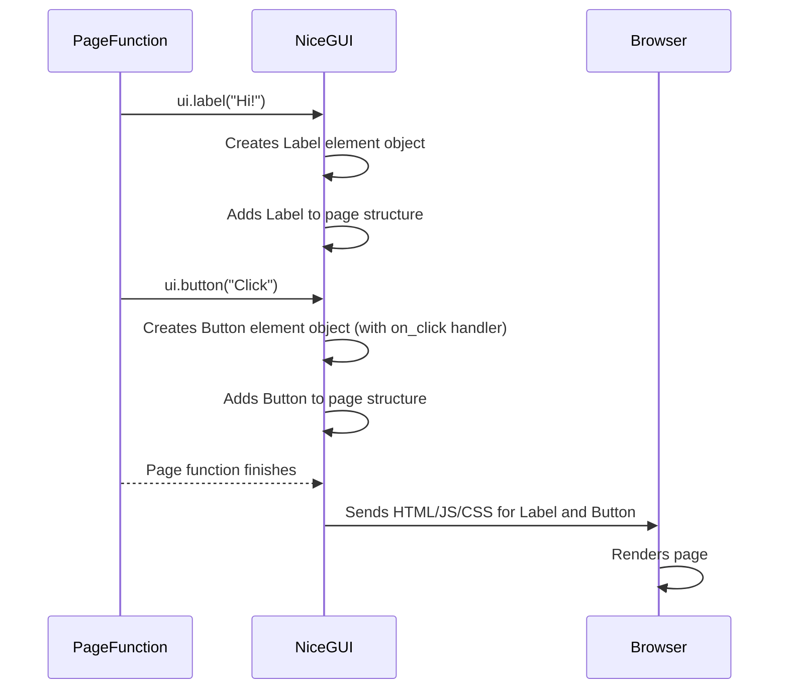

# Chapter 2: UI Elements

Welcome back to the NiceGUI tutorial! In [Chapter 1: App and Page Management](01_app_and_page_management_.md), you learned how to start your NiceGUI application and define different pages for different URLs using `ui.run()` and `@ui.page()`. You saw how `ui.navigate.to()` could take users from one blank page to another.

But let's be honest, a web page isn't very useful if it's just blank or only says "Hello World!". The real power of a graphical user interface (GUI) comes from the visual components that display information and allow users to interact.

This is where **UI Elements** come in.

### What are UI Elements?

Think of a web page or any windowed application you use daily. It's made up of various pieces: text labels, buttons you can click, boxes where you type text, checkboxes you can tick, sliders you can drag, pictures, tables, and many more. These individual pieces are the UI elements (or widgets or controls, depending on the framework).

In NiceGUI, these elements are the basic building blocks you place onto your pages. They are how you show things to the user and how the user gives input back to your application.

NiceGUI makes creating these elements incredibly simple using Python functions that typically start with `ui.`.

### Your First UI Element: Displaying Text

The simplest way to put something on your page is to display some text. For this, NiceGUI provides the `ui.label` element.

Let's modify our home page from Chapter 1 to display a welcome message using `ui.label`:

```python
from nicegui import ui

@ui.page('/')
def home_page():
    # Create a label element with the text "Hello from NiceGUI!"
    ui.label('Hello from NiceGUI!')

ui.run()
```

If you run this code (`python your_file_name.py`) and open your browser to `http://localhost:8000`, you will now see a page with the text "Hello from NiceGUI!".

That's it! You just created your first UI element. The `ui.label()` function call creates the label and automatically adds it to the current page being built by the `home_page` function.

### Adding Interaction: Buttons

Displaying text is useful, but interacting with the user is key to a dynamic application. Buttons are one of the most common interaction elements. You create a button using `ui.button`.

A button usually has text on it and something happens when you click it. You specify the button's text as the first argument and what should happen on click using the `on_click` parameter. We'll cover handling events like clicks in more detail in [Chapter 4: Event Handling](04_event_handling_.md), but for now, let's just make a button that also adds a label when clicked.

```python
from nicegui import ui

@ui.page('/')
def home_page():
    ui.label('Click the button:')

    # Create a button with the text "Click Me"
    # When clicked, it will run the anonymous function (lambda)
    # This lambda function creates another label with different text
    ui.button('Click Me', on_click=lambda: ui.label('Button clicked!'))

ui.run()
```

Run this code and visit the page. You'll see "Click the button:" followed by a button labeled "Click Me". Clicking the button will make the text "Button clicked!" appear below it.

This shows the basic pattern:
1.  `ui.button('Button Text', ...)` creates the visual button.
2.  `on_click=...` tells NiceGUI what Python code to run when the user clicks it.
3.  The code inside `on_click` (in this case, `lambda: ui.label('Button clicked!')`) can create *new* UI elements dynamically or modify existing ones (we'll see modifying later).

### Getting User Input: Input Fields

Another fundamental element is one that allows the user to type text. This is done with `ui.input`.

You can provide a `label` argument to `ui.input` which acts as placeholder text or a floating label above the input field.

```python
from nicegui import ui

@ui.page('/')
def home_page():
    # Create an input field with a label "Enter your name"
    name_input = ui.input(label='Enter your name')

    # You can also add more elements after the input
    ui.label('Type something above!')

ui.run()
```

Running this will show an input box where you can type. The text "Enter your name" will be displayed initially as a placeholder or label.

### Combining Elements: A Simple Form

Let's combine these elements to build a slightly more useful page. We'll have an input field for a name and a button that, when clicked, displays a greeting including the name entered.

```python
from nicegui import ui

@ui.page('/')
def home_page():
    ui.label('Welcome!')

    # Create an input field
    name_input = ui.input(label='Your Name')

    # Create a label that will initially be empty
    greeting_label = ui.label()

    # Create a button
    # When clicked, it updates the greeting_label's text
    ui.button('Greet Me', on_click=lambda: greeting_label.set_text(f'Hello, {name_input.value}!'))
    # We use .set_text() to change the label's content after it's created.
    # We access the input's text using .value

ui.run()
```

In this example:
1.  We create the `name_input` and `greeting_label` elements. We store them in variables so we can refer to them later.
2.  The `greeting_label` is initially empty.
3.  The `ui.button` is created. Its `on_click` function uses `greeting_label.set_text()` to change the text of the `greeting_label`.
4.  Inside the `set_text()` call, we use an f-string `f'Hello, {name_input.value}!'`. This takes the *current* text from the `name_input` element (accessed via `name_input.value`) and includes it in the greeting message.

Run this code, type your name into the box, and click "Greet Me". You'll see the greeting appear below the button! This simple example demonstrates how different UI elements can work together and how you can dynamically update the UI based on user interaction.

### Many More Elements

NiceGUI offers a wide variety of built-in UI elements beyond labels, buttons, and inputs. You can find elements for:

| Category       | Examples                                           | `ui.` calls                                   |
| :------------- | :------------------------------------------------- | :-------------------------------------------- |
| **Display**    | Images, Icons, HTML, Markdown, Progress Bars       | `ui.image()`, `ui.icon()`, `ui.html()`, etc.  |
| **Input**      | Checkboxes, Radio buttons, Select dropdowns, Sliders | `ui.checkbox()`, `ui.radio()`, `ui.select()`, etc. |
| **Collections**| Tables, Trees, Lists, Grids                        | `ui.table()`, `ui.tree()`, `ui.grid()`, etc.    |
| **Advanced**   | 3D Scenes, Plotting, Editors                       | `ui.scene()`, `ui.line_plot()`, `ui.editor()` |

Each of these elements is created with a simple `ui.` function call and often has parameters to configure its appearance or behavior (like the button's `on_click` or the input's `label`). Exploring the NiceGUI documentation and examples is the best way to discover all the available elements.

### How UI Elements Work (Under the Hood)

Let's revisit the process from [Chapter 1: App and Page Management](01_app_and_page_management_.md) and see where UI elements fit in.

When a user's browser requests a page (like `/`):
1.  The NiceGUI server receives the request.
2.  It finds the Python function decorated with `@ui.page('/')` (our `home_page` function).
3.  **The Server Executes Your Page Function:** NiceGUI starts running your `home_page()` function line by line.
4.  **Creating Elements:** When your code calls `ui.label(...)`, `ui.input(...)`, `ui.button(...)`, etc., these functions don't *immediately* send something to the browser. Instead, they create **element objects** in the server's memory. These objects represent the label, the input field, the button, and their properties (like text, label, `on_click` function, etc.).
5.  **Building the Page Structure:** NiceGUI keeps track of the order in which you create these elements within the page function. It builds an internal representation (like a tree structure) of all the elements on that page.
6.  **Translating to Web Code:** Once the page function finishes executing, NiceGUI has the complete structure of elements for that page. It then translates this structure into the necessary HTML, CSS, and JavaScript code that web browsers understand.
7.  **Sending the Response:** NiceGUI sends this web code back to the user's browser.
8.  **Browser Renders:** The browser receives the code and draws the elements on the screen, making the page visible to the user.

When a user interacts with an element (like clicking the button in our example), the browser sends a message back to the NiceGUI server. NiceGUI receives this message, identifies which element was interacted with, and then runs the corresponding Python code you provided (e.g., the `lambda` function assigned to the `on_click` parameter). This Python code can then create new elements, modify existing ones (like changing the label's text), or trigger other actions. NiceGUI detects these changes and updates the browser page accordingly.

Here's a simplified look at step 4 and 5 in the process:



Essentially, your Python code *defines* the UI structure and behavior, and NiceGUI takes care of rendering it in the browser and handling the communication back and forth.

### Conclusion

You've taken a big step by learning about UI Elements! You now know:
*   UI elements are the visual parts of your application.
*   NiceGUI provides many elements accessible via `ui.` functions.
*   You can add labels, buttons, input fields, and many other elements to your pages by calling their respective `ui.` functions within a `@ui.page()` function.
*   You can capture element references in variables to interact with them later (like changing text or reading input values).
*   Under the hood, NiceGUI builds the page structure from your `ui.` calls and translates it into web code.

You can now place elements on a page, but you might notice they just appear one after another, vertically. To arrange elements more nicely (side-by-side, in columns, cards, etc.), you need **Layout and Containers**.

In the next chapter, we'll explore how to use containers to group and arrange your UI elements effectively.

[Next Chapter: Layout and Containers](03_layout_and_containers_.md)

---

<sub><sup>Generated by [AI Codebase Knowledge Builder](https://github.com/The-Pocket/Tutorial-Codebase-Knowledge).</sup></sub> <sub><sup>**References**: [[1]](https://github.com/zauberzeug/nicegui/blob/fd25a94e12bc03e5852ae292ff5cd6ea84e4c804/examples/3d_scene/main.py), [[2]](https://github.com/zauberzeug/nicegui/blob/fd25a94e12bc03e5852ae292ff5cd6ea84e4c804/examples/ai_interface/main.py), [[3]](https://github.com/zauberzeug/nicegui/blob/fd25a94e12bc03e5852ae292ff5cd6ea84e4c804/examples/chat_with_ai/main.py), [[4]](https://github.com/zauberzeug/nicegui/blob/fd25a94e12bc03e5852ae292ff5cd6ea84e4c804/examples/editable_ag_grid/main.py), [[5]](https://github.com/zauberzeug/nicegui/blob/fd25a94e12bc03e5852ae292ff5cd6ea84e4c804/examples/editable_table/main.py), [[6]](https://github.com/zauberzeug/nicegui/blob/fd25a94e12bc03e5852ae292ff5cd6ea84e4c804/examples/generate_pdf/main.py), [[7]](https://github.com/zauberzeug/nicegui/blob/fd25a94e12bc03e5852ae292ff5cd6ea84e4c804/examples/image_mask_overlay/main.py), [[8]](https://github.com/zauberzeug/nicegui/blob/fd25a94e12bc03e5852ae292ff5cd6ea84e4c804/examples/pandas_dataframe/main.py), [[9]](https://github.com/zauberzeug/nicegui/blob/fd25a94e12bc03e5852ae292ff5cd6ea84e4c804/examples/slots/main.py), [[10]](https://github.com/zauberzeug/nicegui/blob/fd25a94e12bc03e5852ae292ff5cd6ea84e4c804/examples/table_and_slots/main.py)</sup></sub>