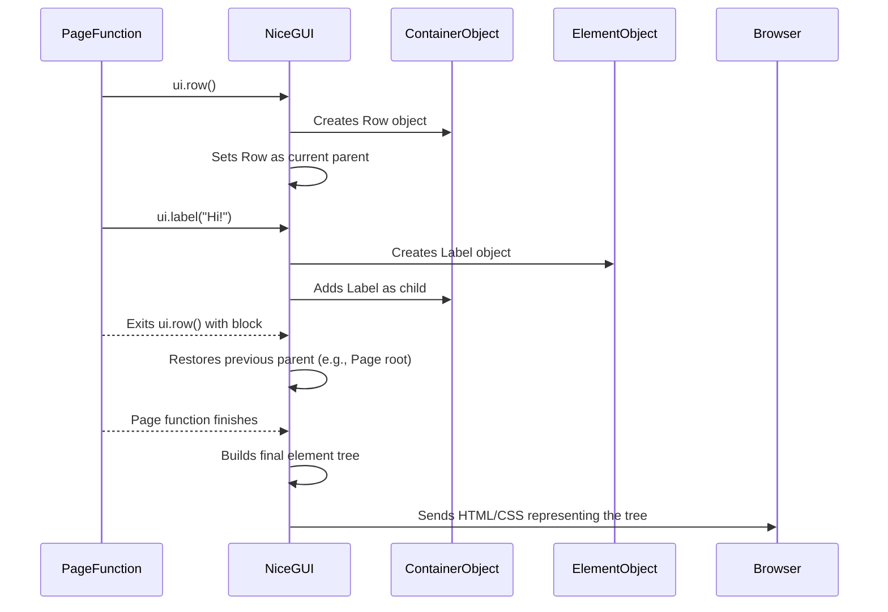

# Chapter 3: Layout and Containers

Welcome back to the NiceGUI tutorial! In [Chapter 1: App and Page Management](01_app_and_page_management_.md), you learned how to set up your application and define different pages. In [Chapter 2: UI Elements](02_ui_elements_.md), you discovered how to add interactive elements like labels, buttons, and input fields to those pages using simple `ui.` function calls.

If you've been experimenting, you might have noticed something: all the UI elements you add simply appear one after another, stacking up vertically on the page by default. While this is simple, real-world applications need more control over how elements are arranged. You often want things side-by-side, grouped visually, or organized into specific sections.

This is where **Layout and Containers** come in.

### What are Layout and Containers?

Think of containers as special "boxes" or regions on your page that are designed to hold and arrange other UI elements. Instead of elements just floating directly on the page, you place them *inside* a container, and the container dictates how its contents are laid out.

These containers help you structure and organize your user interface, making it more visually appealing and easier for users to understand.

### Our Goal: Arranging Elements Side-by-Side

Let's take a simple use case we encountered in the last chapter: a label and a button. By default, they appear one below the other:

```python
from nicegui import ui

@ui.page('/')
def main_page():
    ui.label('This is a label.')
    ui.button('This is a button.')

ui.run()
```

If you run this, the label will be on the first line, and the button on the second. Our goal is to make them appear *next to each other* on the same line using a container.

### Introducing `ui.row()` for Side-by-Side Layout

The most common container for arranging items horizontally (side-by-side) is `ui.row()`. To place elements inside a container, you use Python's `with` statement. This is a standard Python feature that, in NiceGUI's case, tells the system that any `ui.element()` calls made *within* the `with` block should be added as children of that container.

Here's how you use `ui.row()` to put our label and button next to each other:

```python
from nicegui import ui

@ui.page('/')
def main_page():
    # Start a row container
    with ui.row():
        # Elements inside this 'with' block will be placed horizontally
        ui.label('This label is in the row.')
        ui.button('This button is also in the row.')

ui.run()
```

Run this code. Now, instead of stacking, the label "This label is in the row." and the button "This button is also in the row." will appear on the same line, next to each other!

*   The `with ui.row():` line creates the row container and makes it the current place where new elements will be added.
*   The `ui.label(...)` and `ui.button(...)` calls happen *inside* the `with` block. NiceGUI automatically adds them as children to the `ui.row` container that was just created.
*   Once the `with` block ends (because the indentation goes back), NiceGUI stops adding elements to that specific row container (unless you start another `with` block for the same container object, which is less common).

### Stacking Elements Explicitly with `ui.column()`

As mentioned, elements stack vertically by default. This default behavior is essentially like putting everything inside a `ui.column()` container. While you don't always need to wrap everything in `ui.column()`, it's useful when you want to explicitly group elements vertically, perhaps to apply styling to the whole group or to nest it inside another container like a row.

Here's an example showing explicit columns, which results in the same vertical stacking as the default:

```python
from nicegui import ui

@ui.page('/')
def main_page():
    # Start a column container
    with ui.column():
        # Elements inside this 'with' block will be placed vertically
        ui.label('First label in column.')
        ui.label('Second label in column.')
        ui.button('Button in column.')

ui.run()
```

This will show the label, then the second label below it, and the button below that, just like the default. Using `ui.column()` explicitly makes the structure clearer and allows you to treat that group of elements as a single unit for layout or styling purposes.

### Grouping Elements Visually with `ui.card()`

Sometimes you don't just want to arrange elements, but also visually group them together, perhaps with a border, background, and some spacing to make them stand out as a related block of content. The `ui.card()` container is perfect for this.

A card typically contains other elements like labels, buttons, inputs, etc., presenting them within a distinct, card-like visual boundary.

```python
from nicegui import ui

@ui.page('/')
def main_page():
    # Start a card container
    with ui.card():
        # Elements inside this card will be visually grouped
        ui.label('User Information')
        ui.input(label='Name')
        ui.button('Save')

ui.run()
```

Run this, and you'll see a rectangular card outline on the page. Inside this card, the "User Information" label, the "Name" input field, and the "Save" button will be displayed, stacked vertically by default within the card. `ui.card` is often used within other layout containers like rows or columns to build complex dashboards or sections.

### Nesting Containers

The real power of layout comes from nesting containers within each other. You can place a `ui.row` inside a `ui.column`, a `ui.column` inside a `ui.row`, cards inside rows or columns, and so on, to create almost any layout structure you need.

Let's create a row that contains two columns, each with a label:

```python
from nicegui import ui

@ui.page('/')
def main_page():
    # Outer container: a row
    with ui.row():
        # First inner container: a column
        with ui.column():
            ui.label('Column 1, Item 1')
            ui.label('Column 1, Item 2')

        # Second inner container: another column
        with ui.column():
            ui.label('Column 2, Item 1')
            ui.label('Column 2, Item 2')

ui.run()
```

This code will produce a layout where:
*   There is one main horizontal `ui.row`.
*   Inside this row, there are two vertical `ui.column` containers.
*   The first column contains "Column 1, Item 1" above "Column 1, Item 2".
*   The second column (next to the first column because they are both in the `ui.row`) contains "Column 2, Item 1" above "Column 2, Item 2".

Visually, it will look something like this:

```
+-------------------+-------------------+
| Column 1, Item 1  | Column 2, Item 1  |
| Column 1, Item 2  | Column 2, Item 2  |
+-------------------+-------------------+
      (Column 1)          (Column 2)
-----------------------------------------
            (Outer Row)
```

This nesting pattern is fundamental to building complex layouts with NiceGUI.

### Other Layout Concepts and Containers

NiceGUI offers more specialized containers and layout options:

*   `ui.grid()`: Arranges elements in a grid structure.
*   `ui.scene()`: A special container for displaying interactive 3D content.
*   `ui.html()`: Allows inserting raw HTML, which can include custom layout using standard web technologies like CSS Grid or Flexbox if needed for advanced cases.

NiceGUI's layout capabilities are built on top of [Quasar](https://quasar.dev/), a Vue.js framework, which itself uses modern CSS (like Flexbox and Grid). For more advanced layout control, you can often apply CSS styles directly to NiceGUI elements or containers using the `.classes(...)` or `.style(...)` methods (we'll touch upon styling later in the tutorial).

### How Layout and Containers Work (Under the Hood)

Let's look at how NiceGUI handles containers and the `with` statement.

When NiceGUI executes your page function (like `main_page()` decorated with `@ui.page('/')`):
1.  **Entering the Page Function:** NiceGUI starts building the element tree for the current page. Initially, the "current parent" where new elements are added is the root of the page.
2.  **Calling a Container:** When you call `ui.row()`, `ui.column()`, `ui.card()`, etc., NiceGUI creates a new container element object in memory.
3.  **Setting the "Current Parent" (The `with` statement):** The `with` statement for a container object is special. When you enter the `with ui.container():` block, NiceGUI temporarily changes the "current parent" pointer to this new container object.
4.  **Adding Children:** Now, any `ui.element(...)` call (like `ui.label()`, `ui.button()`, even *other container calls*) inside this `with` block will automatically add the newly created element object as a *child* of the container that is currently set as the "current parent".
5.  **Exiting the `with` block:** When the `with` block finishes (due to indentation decreasing or an exception), NiceGUI restores the "current parent" back to what it was before entering the block (usually the container holding the outer `with` statement, or the page root if there was no outer `with`).
6.  **Building the Tree:** As your page function runs and you create elements and containers, NiceGUI builds a tree-like structure in memory, representing the hierarchy of elements and how they are nested within containers.
7.  **Translating and Rendering:** Once the page function finishes, NiceGUI translates this entire element tree structure into the necessary web code (HTML, which represents the structure; CSS, which styles the containers and elements, including how they lay out their children; and JavaScript for interactivity). This web code is then sent to the browser for rendering.

Here's a simplified sequence diagram showing how a container adds its children:



This mechanism using the `with` statement and the "current parent" is a core pattern in NiceGUI for building nested UI structures.

### Conclusion

You've now learned the crucial concept of Layout and Containers in NiceGUI! You know:

*   Containers (`ui.row`, `ui.column`, `ui.card`, etc.) help organize and arrange UI elements on the page.
*   You use the `with` statement to add elements *inside* a container.
*   `ui.row()` arranges elements horizontally, and `ui.column()` arranges them vertically.
*   `ui.card()` provides a visual grouping container.
*   Containers can be nested within each other to create complex layouts.
*   Under the hood, NiceGUI uses the `with` statement to manage a "current parent" container and builds a hierarchical element tree before rendering.

With the ability to place and organize elements using containers, your pages can now become much more structured and visually appealing. But a static layout isn't enough for dynamic web applications. You need elements to respond to user actions.

In the next chapter, we'll dive into [Event Handling](04_event_handling_.md) – how to make your application react when a user clicks a button, types into an input, or interacts with your UI in other ways.

[Next Chapter: Event Handling](04_event_handling_.md)

---

<sub><sup>Generated by [AI Codebase Knowledge Builder](https://github.com/The-Pocket/Tutorial-Codebase-Knowledge).</sup></sub> <sub><sup>**References**: [[1]](https://github.com/zauberzeug/nicegui/blob/fd25a94e12bc03e5852ae292ff5cd6ea84e4c804/examples/ai_interface/main.py), [[2]](https://github.com/zauberzeug/nicegui/blob/fd25a94e12bc03e5852ae292ff5cd6ea84e4c804/examples/chat_app/main.py), [[3]](https://github.com/zauberzeug/nicegui/blob/fd25a94e12bc03e5852ae292ff5cd6ea84e4c804/examples/menu_and_tabs/main.py), [[4]](https://github.com/zauberzeug/nicegui/blob/fd25a94e12bc03e5852ae292ff5cd6ea84e4c804/examples/table_and_slots/main.py), [[5]](https://github.com/zauberzeug/nicegui/blob/fd25a94e12bc03e5852ae292ff5cd6ea84e4c804/examples/trello_cards/main.py)</sup></sub>