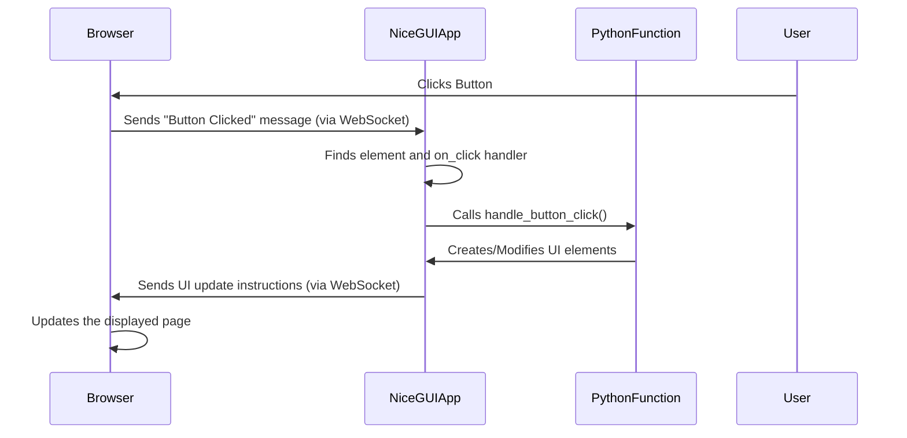

# Chapter 4: Event Handling

Welcome back to the NiceGUI tutorial! In the previous chapters, you learned how to structure your application with [App and Page Management](01_app_and_page_management_.md), add various [UI Elements](02_ui_elements_.md) like labels, buttons, and inputs, and arrange them nicely on your page using [Layout and Containers](03_layout_and_containers_.md).

You can now display information and structure your interface, but your application is still mostly static. How do you make it respond when a user clicks a button, types text, or interacts with the elements you've placed?

This is where **Event Handling** comes in.

### What is Event Handling?

In a web application, users perform actions all the time: clicking buttons, typing into fields, selecting items from a dropdown, uploading files, moving a mouse, etc. Each of these user actions triggers an "**event**" in the web browser.

Event handling is the mechanism that allows your Python code running on the server to **listen** for these events happening in the user's browser and **respond** to them by running specific Python functions. It's the bridge that connects frontend user interaction to your backend Python logic, making your UI dynamic and interactive.

### The Core Idea: Connecting Events to Functions

In NiceGUI, you handle events by telling a UI element: "When this specific event happens to you (e.g., you are clicked), please run this specific Python function."

You do this by passing a Python function to a parameter on the UI element creation call. These parameters are typically named starting with `on_`, followed by the event type (like `on_click`, `on_change`, `on_upload`).

Let's revisit the simple button example from [Chapter 2: UI Elements](02_ui_elements_.md) and focus specifically on the `on_click` parameter.

### Handling Button Clicks (`on_click`)

A button is designed to be clicked. The most common event for a button is, unsurprisingly, `on_click`. We assign a Python function to this parameter.

```python
from nicegui import ui

def handle_button_click():
    # This function will run when the button is clicked
    ui.label('Button was clicked!') # Add a new label to the page

@ui.page('/')
def main_page():
    ui.label('Click the button:')
    ui.button('Click Me', on_click=handle_button_click) # Connects the click event to the function

ui.run()
```

Run this code. You'll see the initial label and the button. When you click the "Click Me" button, the `handle_button_click()` function is executed on the server. This function creates a *new* `ui.label` element, which NiceGUI then automatically adds to the page and sends to the browser for display.

This is the fundamental pattern: define a function that performs an action, and connect it to an element's event parameter.

You don't have to add new elements. The event handler can modify existing elements too. Let's change the text of an existing label when the button is clicked:

```python
from nicegui import ui

def update_label():
    # Change the text of the existing label
    status_label.set_text('Status: Button clicked!')

@ui.page('/')
def main_page():
    global status_label # Declare the label so the function can access it

    ui.label('Status: Waiting for click...')
    status_label = ui.label('Status: Waiting...') # Store the label in a variable we can access later

    ui.button('Click Me', on_click=update_label) # Connect the click event

ui.run()
```

In this example, we:
1.  Create a label `status_label` and store a reference to it in a variable.
2.  Define the `update_label` function. Inside this function, we use the `.set_text()` method of the `status_label` object to change its displayed text.
3.  Connect `update_label` to the button's `on_click`.

Now, clicking the button changes the text of the "Status: Waiting..." label to "Status: Button clicked!".

### Handling Input Changes (`on_change`, `on_value_change`, `on_input`)

Input fields (`ui.input`, `ui.textarea`, etc.) have different events that are useful for reacting to user typing or value changes. Common ones include:

*   `on_change`: Triggered when the input field loses focus and its value has changed since it last gained focus.
*   `on_value_change`: Triggered immediately whenever the value changes (as the user types or if the value is changed programmatically).
*   `on_input`: Similar to `on_value_change`, often used with elements like sliders or color pickers.

Let's use `on_value_change` to display the input text in real-time as the user types:

```python
from nicegui import ui
from nicegui.events import ValueChangeEventArguments

def show_input_text(event: ValueChangeEventArguments):
    # The event object contains details about the event
    # For value change events, event.value holds the new value
    result_label.set_text(f'You typed: {event.value}')

@ui.page('/')
def main_page():
    global result_label # Declare label for function access

    ui.label('Type something:')
    ui.input(label='Your text', on_value_change=show_input_text) # Connect change event

    result_label = ui.label('You typed: ') # Label to show the result

ui.run()
```

When you run this, as you type into the input box, the text below it updates immediately.

Notice the `event: ValueChangeEventArguments` parameter in the `show_input_text` function signature. When an event handler is called, NiceGUI often passes an **event object** containing useful information about what happened. For value changes, `event.value` gives you the new value of the element that triggered the event. Different event types provide different kinds of information in the event object. You can usually type hint the event argument (e.g., `events.ClickEventArguments`, `events.UploadEventArguments`, `events.GenericEventArguments`) to see what attributes are available.

### Handling File Uploads (`on_upload`)

Uploading files is a specific type of user interaction. The `ui.upload` element provides an `on_upload` event handler. The event object for uploads is `nicegui.events.UploadEventArguments`. It contains details about the uploaded file, including its content.

Here's a simple example that just shows the filename and size after upload:

```python
from nicegui import ui
from nicegui.events import UploadEventArguments

def handle_upload(event: UploadEventArguments):
    # event.name is the filename
    # event.content is a file-like object with the data
    file_size = len(event.content.read()) # Read content to get size

    ui.label(f'Uploaded file: {event.name} ({file_size} bytes)')
    # Note: event.content is consumed after reading. Store it if needed later.

@ui.page('/')
def main_page():
    ui.label('Upload a file:')
    ui.upload(on_upload=handle_upload) # Connect the upload event

ui.run()
```

Run this, click the upload area, and select a file. After the file is uploaded (which happens automatically by default), the `handle_upload` function runs, and a label showing the file details appears below the upload element.

Complex tasks like processing the file content or saving it would happen *inside* the `handle_upload` function (you can see examples of using `event.content` in the provided snippets like `examples/ai_interface/main.py` or `examples/audio_recorder/audio_recorder.py`, though those examples involve external libraries).

### Generic Event Arguments (`events.GenericEventArguments`)

Many NiceGUI elements emit events that are not as specific as `on_click` or `on_value_change` but are still useful. You can listen to these custom events using the `.on('event_name', handler_function)` method available on most elements. The handler function for these events typically receives a `nicegui.events.GenericEventArguments` object. This object has a dictionary `event.args` that contains the specific data related to that event, provided by the underlying web component.

While this is a bit more advanced, it's good to know it exists for custom or less common events. For example, the table element (`ui.table`) in `examples/editable_table/main.py` uses `.on('rename', rename)` and `.on('delete', delete)` to handle custom events emitted by the table component when a row is renamed or deleted through the UI popups. The data about which row was affected is available in `event.args`.

### How Event Handling Works (Under the Hood)

Let's see what happens behind the scenes when a user interacts with your NiceGUI app.

Recall from previous chapters that your Python code runs on the server, and NiceGUI communicates with the user's browser (the frontend) using WebSockets.

1.  **Setup:** When your `@ui.page()` function runs, NiceGUI creates the UI element objects in memory. When it encounters `on_click=...` or `on_change=...`, it stores a reference to your provided Python function alongside the element object. It then sends instructions to the browser to create the visual element (button, input, etc.) and sets up JavaScript code to listen for specific browser events (like a DOM 'click' event).
2.  **User Interaction:** The user interacts with the element in their browser (e.g., clicks the button).
3.  **Browser Sends Event:** The JavaScript code attached to the element detects the browser event. It gathers relevant information (like the element's ID, the event type, and any specific data like the new value for an input or file content for an upload) and sends a message back to the NiceGUI server over the WebSocket connection.
4.  **Server Receives Event:** The NiceGUI server receives the message from the browser.
5.  **Finding the Handler:** NiceGUI looks up which element object corresponds to the ID sent from the browser and which Python function is registered for that specific event type (`on_click`, `on_change`, etc.) for that element.
6.  **Executing the Handler:** NiceGUI calls the registered Python function (e.g., `handle_button_click`, `show_input_text`), often creating and passing an appropriate event object (`event`) with the data received from the browser.
7.  **Python Logic Runs:** Your Python function executes its code. This might involve changing the state of variables, updating element properties (`set_text`, `set_source`, etc.), creating new elements (`ui.label(...)` inside the handler), or interacting with other parts of your application or external services (like the AI models in `examples/ai_interface/main.py`).
8.  **Detecting Changes:** NiceGUI monitors the changes made by your handler function to the UI element objects in memory.
9.  **Sending Updates:** NiceGUI prepares instructions about the detected changes (e.g., "add a new label with this text", "change the text of this label", "change the source of this image") and sends these instructions back to the browser over the WebSocket.
10. **Browser Updates UI:** The JavaScript code in the browser receives the update instructions and modifies the web page dynamically without needing a full page reload.

Here's a simplified sequence:



This continuous loop of browser events triggering server-side Python code, which in turn triggers UI updates in the browser, is the foundation of making interactive web applications with NiceGUI.

### More Event Types

NiceGUI elements support many different event types depending on their nature. While `on_click` and `on_change` are very common, you might encounter:

*   `on_submit` (e.g., for a form or input field when Enter is pressed)
*   `on_keypress`, `on_keydown`, `on_keyup` (for keyboard events)
*   `on_focus`, `on_blur` (when an element gains or loses focus)
*   `on_select`, `on_add`, `on_remove` (for list or selection elements)
*   `on_move`, `on_start`, `on_end` (for draggable elements or sliders)
*   `on_content_add`, `on_content_update`, `on_content_delete` (for editors)
*   And many more specific to different elements like cameras, joysticks, etc.

The NiceGUI API documentation for each element is the best place to find the full list of supported events and the type of event argument they provide.

### Conclusion

You've now grasped the essential concept of Event Handling in NiceGUI! You know:

*   User actions in the browser trigger "events".
*   You connect these browser events to specific Python functions using `on_...` parameters on UI elements.
*   Common events include `on_click` for buttons, and `on_change`/`on_value_change` for inputs.
*   Event handlers often receive an `event` object with details about the interaction.
*   Under the hood, NiceGUI uses WebSockets to communicate events from the browser to your server-side Python code and send UI updates back.

You can now make your UI elements trigger Python code execution, allowing your application to react to user input and actions. This is a powerful way to build interactivity.

However, sometimes you don't just want to *react* to an event; you want the UI to automatically *stay in sync* with your Python data. This concept, called **State Binding**, offers an alternative way to keep your UI updated automatically whenever your Python variables change, without explicitly handling every single event.

In the next chapter, we'll explore [State Binding](05_state_binding_.md) and see how it can simplify keeping your UI consistent with your application's data.

[Next Chapter: State Binding](05_state_binding_.md)

---

<sub><sup>Generated by [AI Codebase Knowledge Builder](https://github.com/The-Pocket/Tutorial-Codebase-Knowledge).</sup></sub> <sub><sup>**References**: [[1]](https://github.com/zauberzeug/nicegui/blob/fd25a94e12bc03e5852ae292ff5cd6ea84e4c804/examples/ai_interface/main.py), [[2]](https://github.com/zauberzeug/nicegui/blob/fd25a94e12bc03e5852ae292ff5cd6ea84e4c804/examples/audio_recorder/audio_recorder.py), [[3]](https://github.com/zauberzeug/nicegui/blob/fd25a94e12bc03e5852ae292ff5cd6ea84e4c804/examples/editable_table/main.py), [[4]](https://github.com/zauberzeug/nicegui/blob/fd25a94e12bc03e5852ae292ff5cd6ea84e4c804/examples/fullcalendar/main.py), [[5]](https://github.com/zauberzeug/nicegui/blob/fd25a94e12bc03e5852ae292ff5cd6ea84e4c804/examples/node_module_integration/main.py), [[6]](https://github.com/zauberzeug/nicegui/blob/fd25a94e12bc03e5852ae292ff5cd6ea84e4c804/examples/search_as_you_type/main.py)</sup></sub>