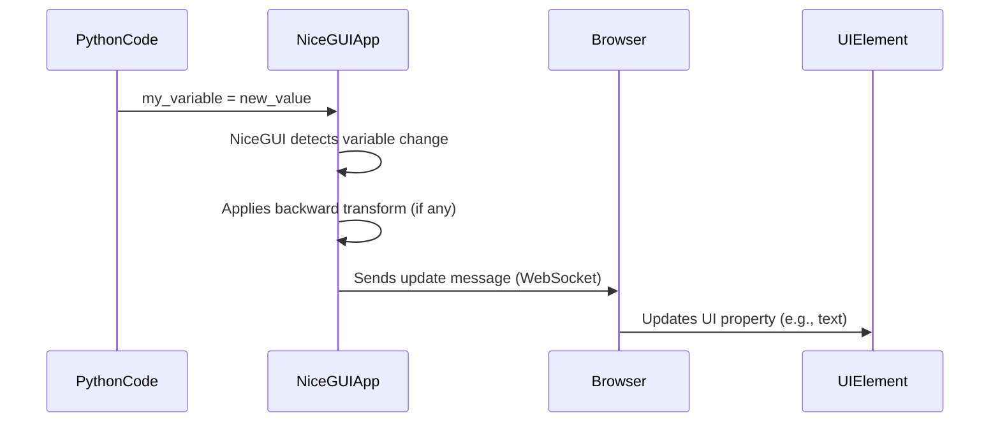
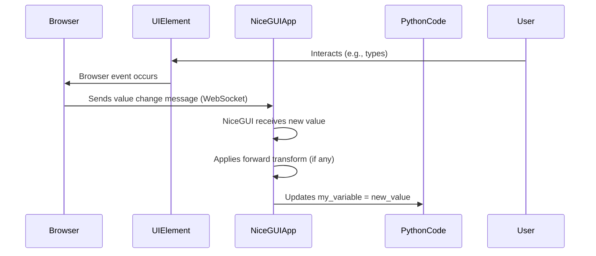

# Chapter 5: State Binding

Welcome back to the NiceGUI tutorial! In our previous chapters, we've learned how to structure our application with [App and Page Management](01_app_and_page_management_.md), add [UI Elements](02_ui_elements_.md) like labels, buttons, and inputs, arrange them using [Layout and Containers](03_layout_and_containers_.md), and make them interactive using [Event Handling](04_event_handling_.md).

Using event handlers like `on_click` and `on_value_change` is powerful for reacting to user actions. You saw how you could change a label's text or update other parts of the UI within these handlers.

However, consider a situation where you have a Python variable (like a number, a string, or a boolean flag) that represents some state in your application, and you want a UI element (like a label, an input field, or a checkbox) to *always* display the current value of that variable. Every time the variable changes in your Python code, you would need to remember to find the corresponding UI element and update its property (like text, value, or visibility) using methods like `set_text()`. This can become repetitive and difficult to manage, especially if the variable can be changed from multiple places in your code.

This is where **State Binding** comes in.

### What is State Binding?

State binding is a feature that creates a direct, automatic link between a Python variable and a property of a UI element. Instead of writing code to manually update the UI whenever the variable changes, you simply tell NiceGUI: "Keep this UI property synchronized with this Python variable."

NiceGUI then sets up this connection. Whenever the Python variable's value changes, NiceGUI automatically updates the corresponding UI element in the browser.

Binding can be **unidirectional** (data flows only from the Python variable *to* the UI) or **bidirectional** (data flows both ways: from Python variable *to* UI, and from UI interaction *to* Python variable).

### Unidirectional Binding: Python to UI

The most common type of binding is updating the UI based on changes in your Python data. This is called unidirectional binding because the data flows in one direction: **Python -> UI**.

You achieve this using methods like `bind_text_from()`, `bind_value_from()`, `bind_visibility_from()`, and others available on UI elements.

Let's say you have a Python variable `counter` and you want a label to always show its current value.

```python
from nicegui import ui

# A simple Python variable
my_counter = 0

def increment_counter():
    global my_counter # Need global because we are modifying it
    my_counter += 1
    # NOTE: We do NOT manually update the label here!

@ui.page('/')
def main_page():
    global my_counter # Need global to access it

    ui.label('Counter value:')
    # Create a label and bind its 'text' property
    # to the 'my_counter' variable from the main module
    # Data flows FROM my_counter TO the label's text
    ui.label().bind_text_from(globals(), 'my_counter')

    ui.button('Increment', on_click=increment_counter)

ui.run()
```

If you run this code:
1.  You'll see the label showing "Counter value:" and another label (initially empty or showing 0, depending on exact timing/element) below it.
2.  Clicking the "Increment" button runs `increment_counter()`.
3.  Inside `increment_counter()`, the Python variable `my_counter` is increased by 1.
4.  Because the second label is *bound* to `my_counter`, NiceGUI automatically detects this change and updates the label in the browser to show the new value.

You don't need to write `my_label.set_text(str(my_counter))` inside the `increment_counter` function. The binding handles the synchronization for you!

*   `bind_text_from(obj, 'name')`: Binds the element's text to `obj.name` or `obj['name']`.
*   `bind_value_from(obj, 'name')`: Binds the element's value (e.g., for input fields, sliders, checkboxes) to `obj.name` or `obj['name']`.
*   `bind_visibility_from(obj, 'name')`: Binds the element's visibility to `obj.name` or `obj['name']` (if the value is truthy).

You can bind to attributes of objects or keys in dictionaries. The `globals()` function provides a dictionary of all global variables, so `globals(), 'my_counter'` refers to the global variable named `my_counter`.

Here's another example binding the visibility of a label:

```python
from nicegui import ui

# A simple boolean variable
is_message_visible = True

@ui.page('/')
def main_page():
    global is_message_visible # Need global to access it

    ui.label('This message can be hidden.')\
      .bind_visibility_from(globals(), 'is_message_visible') # Bind visibility

    ui.button('Toggle Visibility', on_click=lambda: toggle_visibility())

def toggle_visibility():
    global is_message_visible
    is_message_visible = not is_message_visible # Change the variable

ui.run()
```

Clicking the "Toggle Visibility" button changes the `is_message_visible` boolean variable. Because the label's visibility is bound to this variable, the label automatically appears or disappears on the page.

### Bidirectional Binding: Python <-> UI

Sometimes, you want the synchronization to work both ways. If the Python variable changes, the UI updates, *and* if the user interacts with the UI element (e.g., types in an input field or checks a checkbox), the Python variable also updates automatically. This is called bidirectional binding.

You achieve this using methods like `bind_value()`.

Let's use a `ui.input` field and bind it bidirectionally to a Python string variable.

```python
from nicegui import ui

# A Python string variable
user_name = "Anonymous"

@ui.page('/')
def main_page():
    global user_name # Need global to access it

    ui.label('Your name:')
    # Create an input and bind its 'value' property
    # bidirectionally with the 'user_name' variable
    ui.input(label='Name').bind_value(globals(), 'user_name')

    ui.label('Hello, ').bind_text_from(globals(), 'user_name') # Also bind a label unidirectionally

ui.run()
```

Run this code:
1.  The input field will initially show "Anonymous". The second label will show "Hello, Anonymous". This is the initial sync from Python -> UI.
2.  Type something into the input field (e.g., "Alice"). As you type, the `user_name` variable in Python is automatically updated. The second label, which is unidirectionally bound to `user_name`, also updates automatically to show "Hello, Alice". This is the UI -> Python -> UI flow.
3.  You could, in theory, change the `user_name` variable from another part of your Python code (e.g., another button's click handler), and both the input field *and* the second label would update automatically. This demonstrates the Python -> UI flow for the bidirectional binding.

Bidirectional binding with `bind_value()` is incredibly useful for forms and settings where you want the UI to reflect the current state of your data model and also update the data model as the user interacts. Notice the example `examples/docker_image/app/main.py` uses `bind_value(app.storage.user, 'note')` to synchronize a textarea with user-specific storage, which we'll cover in the next chapter ([Storage](06_storage_.md)).

### Binding with Transformations (`backward` / `forward`)

Sometimes the format of your data in Python isn't exactly what you want to display in the UI. For instance, you might store a temperature in Celsius (a number) but want to display it as "X °C" (a string) in a label. Or you might store a boolean (`True`/`False`) but want a label to show "Active" or "Inactive".

Binding methods like `bind_text_from`, `bind_value_from`, and `bind_value` have an optional `backward` parameter (and `bind_to` has a `forward` parameter). This parameter accepts a function that transforms the value during the binding process.

*   `backward`: The function is applied when the value flows *backward* from the Python variable to the UI element. Use this to format the value for display.
*   `forward`: The function is applied when the value flows *forward* from the UI element back to the Python variable (only relevant for bidirectional binding or `bind_to`). Use this to parse the UI value into the Python variable format.

Let's revisit the temperature example from `examples/custom_binding/main.py` snippet (though we won't create a custom element). We can bind a numerical temperature to a label's text and format it using `backward`.

```python
from nicegui import ui
import random

# A dictionary storing temperatures
temperatures = {'Berlin': 5, 'New York': 15, 'Tokio': 25}

@ui.page('/')
def main_page():
    # Display temperatures for each city
    for city, temp in temperatures.items():
        ui.label(f'{city} temperature:')
        # Bind label text to temperature, transforming it for display
        ui.label()\
          .bind_text_from(temperatures, city, backward=lambda t, city=city: f'{t}°C in {city}')

    ui.button('Update Temperatures', on_click=update_temps)

def update_temps():
    # Update temperatures randomly
    global temperatures
    for city in temperatures:
        temperatures[city] = random.randint(0, 30)
    # NOTE: No explicit UI updates needed because of binding!

ui.run()
```

In this example:
1.  We iterate through the `temperatures` dictionary.
2.  For each city, we create a label for the city name and another label for the temperature value.
3.  The temperature value label uses `bind_text_from(temperatures, city, ...)`. The `backward=lambda t, city=city: f'{t}°C in {city}'` part provides a function.
4.  Whenever the value of `temperatures[city]` changes in Python, NiceGUI calls this `lambda` function with the new temperature value (`t`) and the city name (`city`). The function returns a formatted string (e.g., "15°C in New York"). NiceGUI then sets the label's text to this formatted string.

Clicking the "Update Temperatures" button changes the values in the `temperatures` dictionary. Because of the binding with the `backward` transformation, all the temperature labels on the page update automatically with the new formatted values.

Similarly, for `bind_value` with an input, you might use `backward` to format a number for display in the input (e.g., currency formatting) and `forward` to parse the string entered by the user back into a number.

### How State Binding Works (Under the Hood)

State binding builds upon the WebSocket communication and element tracking mechanisms introduced in [Chapter 2: UI Elements](02_ui_elements_.md) and [Chapter 4: Event Handling](04_event_handling_.md).

When you call a binding method like `bind_text_from()` or `bind_value()`:

1.  **Establishing the Link:** NiceGUI doesn't just set the initial value; it registers that a specific property of a UI element (e.g., the `text` property of a label, the `value` property of an input) should be linked to a specific Python variable (an attribute or dictionary key).
2.  **Monitoring Python State:** NiceGUI keeps track of the Python variable involved in the binding.
3.  **Python -> UI Flow:** When the value of the Python variable changes (e.g., `my_counter += 1`, `user_name = "Bob"`, `temperatures['Berlin'] = 10`), NiceGUI detects this change. If a `backward` transformation function is provided, it runs the function on the new value. NiceGUI then automatically generates a message (via WebSocket) to the browser, telling the specific UI element to update its property with the new (possibly transformed) value.
4.  **UI -> Python Flow (for bidirectional binding):** When the user interacts with a UI element that has bidirectional binding (like typing in a `ui.input` bound with `bind_value`), the browser sends an event message (via WebSocket) to NiceGUI, including the element's new value. If a `forward` transformation function is provided, NiceGUI runs this function on the received value. NiceGUI then automatically updates the linked Python variable with the new (possibly transformed) value. This change might, in turn, trigger Python -> UI updates for other elements bound to the same variable.

Think of binding as setting up automatic watchdogs. A watchdog is attached to your Python variable and another is attached to your UI element property. When one detects a change, it nudges the other via NiceGUI's communication layer to sync up.

Here's a simplified sequence diagram focusing on the Python -> UI flow of `bind_from`:



And here's a simplified diagram showing the UI -> Python flow of `bind_value`:



State binding significantly reduces the amount of manual event handling code needed to keep your UI synchronized with your application's internal data. It's especially powerful when your data model is represented by Python objects or dictionaries.

### Conclusion

You've now learned about State Binding, a powerful NiceGUI feature:

*   It automatically synchronizes Python variables with UI element properties.
*   Unidirectional binding (`bind_text_from`, `bind_value_from`, `bind_visibility_from`) updates the UI when the Python variable changes (Python -> UI).
*   Bidirectional binding (`bind_value`) updates the UI from Python *and* updates the Python variable from user interaction (Python <-> UI).
*   You can bind to attributes of objects or keys in dictionaries.
*   Transformation functions (`backward`, `forward`) allow formatting values between Python and the UI.
*   Under the hood, NiceGUI monitors changes and uses WebSockets to keep everything in sync automatically.

State binding dramatically simplifies keeping your UI consistent with your data model, making your code cleaner and easier to maintain compared to manual updates via event handlers.

Now that you know how to bind UI state to Python variables, you might start thinking about making that state persistent – surviving page reloads or even application restarts, and potentially being specific to a user. This is the domain of **Storage**.

In the next chapter, we'll explore [Storage](06_storage_.md) and how NiceGUI provides built-in ways to store data associated with the user session or the application itself.

[Next Chapter: Storage](06_storage_.md)

---

<sub><sup>Generated by [AI Codebase Knowledge Builder](https://github.com/The-Pocket/Tutorial-Codebase-Knowledge).</sup></sub> <sub><sup>**References**: [[1]](https://github.com/zauberzeug/nicegui/blob/fd25a94e12bc03e5852ae292ff5cd6ea84e4c804/examples/audio_recorder/main.py), [[2]](https://github.com/zauberzeug/nicegui/blob/fd25a94e12bc03e5852ae292ff5cd6ea84e4c804/examples/custom_binding/main.py), [[3]](https://github.com/zauberzeug/nicegui/blob/fd25a94e12bc03e5852ae292ff5cd6ea84e4c804/examples/docker_image/app/main.py), [[4]](https://github.com/zauberzeug/nicegui/blob/fd25a94e12bc03e5852ae292ff5cd6ea84e4c804/examples/table_and_slots/main.py), [[5]](https://github.com/zauberzeug/nicegui/blob/fd25a94e12bc03e5852ae292ff5cd6ea84e4c804/examples/todo_list/main.py), [[6]](https://github.com/zauberzeug/nicegui/blob/fd25a94e12bc03e5852ae292ff5cd6ea84e4c804/examples/webserial/main.py)</sup></sub>