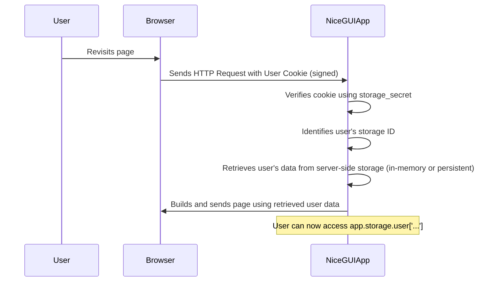

# Chapter 6: Storage

Welcome back to the NiceGUI tutorial! In [Chapter 5: State Binding](05_state_binding_.md), you learned how to automatically synchronize Python variables with your UI elements, making it easy to keep your interface updated as your application's data changes. This is great for managing the state *while the user is interacting* or *while the application is running*.

But what if you want to remember something about a user between their visits? Or perhaps share a piece of information that all users can see? The variables we've used so far exist only as long as your Python script is running or within a specific user session that resets if they close and reopen the browser (unless they revisit very quickly).

This is where **Storage** comes in. Storage in NiceGUI provides built-in ways to save and retrieve data persistently, allowing your application to remember states, settings, or small pieces of information beyond a single page view or even between server restarts.

### What is Storage? Remembering Data

Imagine you're building a simple app that lets a user set a dark mode preference or keeps track of items they added to a cart. If the user closes their browser and comes back later, you want the app to remember their settings or cart items. This requires storing data somewhere so it survives the browser closing and reopening.

NiceGUI offers different "buckets" or scopes of storage, each suited for different needs:

1.  **User Storage (`app.storage.user`):** Data specific to a particular user (or more accurately, a specific browser/device, tracked via a cookie). This data can persist across browser sessions and even server restarts if configured correctly. Useful for preferences, login states (as seen in the authentication examples), or user-specific temporary data.
2.  **Tab Storage (`app.storage.tab`):** Data specific to a single browser tab. This data lasts only as long as that specific tab is open. Useful for temporary state related to a particular page instance, like scroll position or unsaved changes within that tab.
3.  **General Storage (`app.storage.general`):** Data shared across *all* users and *all* tabs connected to your NiceGUI application server. This data can persist across server restarts if configured with a persistent backend. Useful for global settings, counters, or messages visible to everyone.

You access these storage areas through the `app.storage` object, which is available after you import `nicegui` as `ui` or `nicegui.app` as `app`.

### Accessing Storage Like a Dictionary

Each of the storage types (`app.storage.user`, `app.storage.tab`, `app.storage.general`) behaves much like a standard Python dictionary. You can store data using key-value pairs. The keys are strings, and the values can be standard Python data types that can be easily serialized (like strings, numbers, booleans, lists, and dictionaries).

Let's look at how you set, get, and check for data in user storage:

```python
from nicegui import app, ui

@ui.page('/')
def main_page():
    # Set a value in user storage
    app.storage.user['last_visited_page'] = '/'

    # Get a value from user storage, with a default if it's not there
    username = app.storage.user.get('username', 'Guest')
    ui.label(f'Hello, {username}!')

    # Check if a key exists
    if 'dark_mode' in app.storage.user:
        ui.label('Dark mode preference found.')

    # Remove a value
    # if 'some_old_setting' in app.storage.user:
    #     del app.storage.user['some_old_setting']

    # Clear all user storage for this user
    # app.storage.user.clear()

# Important: User storage requires a secret key for security!
# It's used to sign a cookie that identifies the user.
# Replace 'my-secret-key' with a long, random string in production.
ui.run(storage_secret='my-secret-key')
```

This code shows basic dictionary operations on `app.storage.user`. The same operations (`[key] = value`, `.get()`, `in`, `del`, `.clear()`) work for `app.storage.tab` and `app.storage.general` as well.

### Combining Storage with State Binding

Storage becomes incredibly powerful when combined with [State Binding](05_state_binding_.md). You can directly bind UI element properties (like the `value` of an input or the `value` of a dark mode toggle) to keys in `app.storage.user`, `app.storage.tab`, or `app.storage.general`. This means:

*   When the page loads, the UI element will automatically load its initial value from storage.
*   When the user interacts with the UI element (e.g., types in an input field or checks a checkbox), the value in storage is automatically updated.

This simplifies building features like "remember my settings" or "sync this value across all tabs".

Here's how you might bind a `ui.checkbox` for dark mode to user storage, as hinted in the `fastapi` example:

```python
from nicegui import app, ui

@ui.page('/')
def main_page():
    ui.label('Toggle dark mode:')
    # Create a checkbox and bind its 'value' bidirectionally
    # with the 'dark_mode' key in app.storage.user
    ui.checkbox('Dark Mode').bind_value(app.storage.user, 'dark_mode')

    # The ui.dark_mode() element also has a value that can be bound
    ui.dark_mode().bind_value(app.storage.user, 'dark_mode')

# Remember the storage secret!
ui.run(storage_secret='another-secret')
```

Run this code, check/uncheck the "Dark Mode" checkbox, and then refresh the page. You'll see that the checkbox retains its state because its value is saved in `app.storage.user` and loaded again when the page reloads. The `ui.dark_mode()` element itself reflects this state automatically.

You can apply this binding pattern (`.bind_value(app.storage.user, 'some_key')`) to inputs, textareas, sliders, etc., to persist their values for the user.

### Practical Examples of Different Storage Types

Let's create a simple page that demonstrates all three storage types working together, inspired by the `redis_storage` example.

```python
from nicegui import app, ui

@ui.page('/')
async def index_page():
    ui.label('General Storage (Shared by everyone):')
    # Bind an input to general storage
    ui.input('Global Message').bind_value(app.storage.general, 'global_text')

    ui.separator() # Visual separator

    ui.label('User Storage (Specific to your browser):')
    # Bind an input to user storage
    ui.input('Your Persistent Note').bind_value(app.storage.user, 'user_note')

    ui.separator()

    ui.label('Tab Storage (Specific to this browser tab):')
    # Bind an input to tab storage
    # Note: Tab storage becomes available AFTER the client connects
    # ui.run_javascript('console.log("Client connected")', after=0) # Optional: Confirm connection
    await ui.context.client.connected() # Wait for the client connection
    ui.input('Tab-Specific Data').bind_value(app.storage.tab, 'tab_data')


# Required for user storage
# Use a unique secret for your app!
ui.run(storage_secret='my-super-secret-key')
```

Run this example:
1.  Open the page in your browser.
2.  Type something into the "Global Message" input.
3.  Type something into the "Your Persistent Note" input.
4.  Type something into the "Tab-Specific Data" input.
5.  Open a **new tab** in the same browser to the same URL:
    *   The "Global Message" input will show the text you typed in the first tab (shared storage).
    *   The "Your Persistent Note" input will show the text you typed in the first tab (user storage, same user/browser).
    *   The "Tab-Specific Data" input will be empty (new tab, new tab storage).
6.  Now, close *all* tabs for your app and reopen the URL in a **new window or tab**:
    *   The "Global Message" text will still be there (general storage, persists while server runs).
    *   The "Your Persistent Note" text will still be there (user storage, persists across sessions via cookie).
    *   The "Tab-Specific Data" input will be empty (tab storage is gone when the tab closes).
7.  (Optional) If you restart the Python script and then open the page again (without using a persistent backend like Redis):
    *   "Global Message" and "Tab-Specific Data" will be empty (in-memory storage reset).
    *   "Your Persistent Note" might still show the value if the cookie survived, but the server-side mapping could be lost depending on the exact setup (default is in-memory for user storage data too). This is why persistent backends are important for long-term general/user storage survival across server restarts.

This demonstrates the different lifespans and scopes of the three storage types. Notice the `await ui.context.client.connected()` before accessing `app.storage.tab`. Tab storage is specifically linked to the WebSocket connection of that tab, so it's only fully available once the browser client has connected. User and General storage are generally available earlier.

### How Storage Works (Under the Hood)

NiceGUI's storage mechanisms rely on a combination of browser features (cookies, session storage) and server-side Python dictionaries (or persistent backends).

1.  **`app.storage.tab`:** When you write to `app.storage.tab['key'] = value`, the data is primarily managed by the NiceGUI server in memory, associated with the specific WebSocket connection for that tab. NiceGUI also uses mechanisms (often involving the underlying framework like FastAPI and client-side JavaScript) to keep this tab-specific data synchronized with the browser's session storage or similar in-memory structures for that tab. When the tab closes, the WebSocket connection breaks, and the associated server-side and client-side tab storage is discarded.
2.  **`app.storage.user`:** This is slightly more complex and involves the `storage_secret`.
    *   When a user first visits, NiceGUI sends a special cookie to their browser. This cookie doesn't contain your actual data, but a unique identifier linked to *this browser instance* (the "user"). The `storage_secret` is used to sign this cookie, making it tamper-proof and ensuring NiceGUI can trust the identifier on subsequent visits.
    *   When you write to `app.storage.user['key'] = value`, the data is stored server-side in a dictionary associated with the identifier from the user's cookie.
    *   When the user revisits later, the browser sends the cookie back. NiceGUI reads the signed cookie, verifies it using the `storage_secret`, finds the associated server-side storage dictionary for that user identifier, and makes it available via `app.storage.user`.
    *   By default, this server-side dictionary is just in memory. This means user storage survives browser closing (thanks to the cookie) but *not* server restarts (because the server's memory is wiped).
    *   To make user storage survive server restarts, you need to configure a persistent backend (like Redis or a database). The `redis_storage` example shows how `app.storage.user` and `app.storage.general` can be backed by Redis.
3.  **`app.storage.general`:** This data is stored server-side in a single dictionary, shared by all connected users and tabs. By default, this is in-memory and is lost when the server stops. Like user storage, it can be configured to use a persistent backend to survive server restarts.

Here's a simplified sequence for `app.storage.user` on a revisit:



The key takeaway is that `app.storage` provides a convenient, dictionary-like interface in your Python code, and NiceGUI handles the underlying mechanisms to give it the appropriate scope (`tab`, `user`, or `general`) and persistence behavior (in-memory by default, persistent with a backend).

Using a `storage_secret` is vital for user storage security. Without it, malicious users could potentially create or guess storage identifiers and access or modify other users' storage data. The secret ensures that only NiceGUI instances knowing the secret can create valid, signed user cookies.

### Persistent Backends (Advanced)

For production applications where you need `app.storage.user` and `app.storage.general` to reliably persist across server restarts or when running multiple instances of your NiceGUI app behind a load balancer, you need to configure a persistent backend like Redis.

NiceGUI supports this via the `app.add_middleware` mechanism, although setting this up is beyond a beginner chapter. The `examples/redis_storage/main.py` shows how you might integrate a Redis backend using a custom middleware provided by NiceGUI's internals.

```python
# Simplified view (details in examples/redis_storage/main.py)
from nicegui import app, ui
from nicegui.storage import RedisStorage

# Configure Redis connection
redis_storage = RedisStorage('redis://localhost:6379/0')

# Add middleware to make Redis the backend for user and general storage
app.add_middleware(redis_storage.middleware)

# Now app.storage.user and app.storage.general use Redis
@ui.page('/')
def index():
    ui.input('Global').bind_value(app.storage.general, 'global_setting')
    ui.input('My Setting').bind_value(app.storage.user, 'my_setting')

ui.run(storage_secret='required even with Redis for cookie signing')
```

This ensures that when you write to `app.storage.user` or `app.storage.general`, the data is actually saved to Redis, and when you read it, it's retrieved from Redis.

### Conclusion

You've now learned about Storage in NiceGUI! You understand:

*   NiceGUI offers `app.storage.user`, `app.storage.tab`, and `app.storage.general` for saving and retrieving data.
*   `app.storage.user` is specific to a browser/user and can persist across sessions using a cookie (requires `storage_secret`).
*   `app.storage.tab` is specific to a browser tab and lasts as long as the tab is open.
*   `app.storage.general` is shared across all users and tabs.
*   You access these like Python dictionaries.
*   They work seamlessly with [State Binding](05_state_binding_.md) to automatically synchronize UI elements with stored data.
*   By default, storage is in-memory and resets on server restart, but persistent backends (like Redis) can be configured.
*   A `storage_secret` is essential for securing user storage.

With storage, your applications can now remember important information, providing a more personalized and consistent experience for your users.

As your applications grow, you might need to perform tasks that take a long time (like fetching data from a slow API or processing a large file) without freezing the user interface. This requires handling **Concurrency and Background Tasks**.

In the next chapter, we'll explore how to run code in the background in NiceGUI without blocking the UI.

[Next Chapter: Concurrency and Background Tasks](07_concurrency_and_background_tasks_.md)

---

<sub><sup>Generated by [AI Codebase Knowledge Builder](https://github.com/The-Pocket/Tutorial-Codebase-Knowledge).</sup></sub> <sub><sup>**References**: [[1]](https://github.com/zauberzeug/nicegui/blob/fd25a94e12bc03e5852ae292ff5cd6ea84e4c804/examples/authentication/main.py), [[2]](https://github.com/zauberzeug/nicegui/blob/fd25a94e12bc03e5852ae292ff5cd6ea84e4c804/examples/descope_auth/user.py), [[3]](https://github.com/zauberzeug/nicegui/blob/fd25a94e12bc03e5852ae292ff5cd6ea84e4c804/examples/docker_image/app/main.py), [[4]](https://github.com/zauberzeug/nicegui/blob/fd25a94e12bc03e5852ae292ff5cd6ea84e4c804/examples/fastapi/frontend.py), [[5]](https://github.com/zauberzeug/nicegui/blob/fd25a94e12bc03e5852ae292ff5cd6ea84e4c804/examples/google_oauth2/main.py), [[6]](https://github.com/zauberzeug/nicegui/blob/fd25a94e12bc03e5852ae292ff5cd6ea84e4c804/examples/google_one_tap_auth/main.py), [[7]](https://github.com/zauberzeug/nicegui/blob/fd25a94e12bc03e5852ae292ff5cd6ea84e4c804/examples/redis_storage/main.py)</sup></sub>