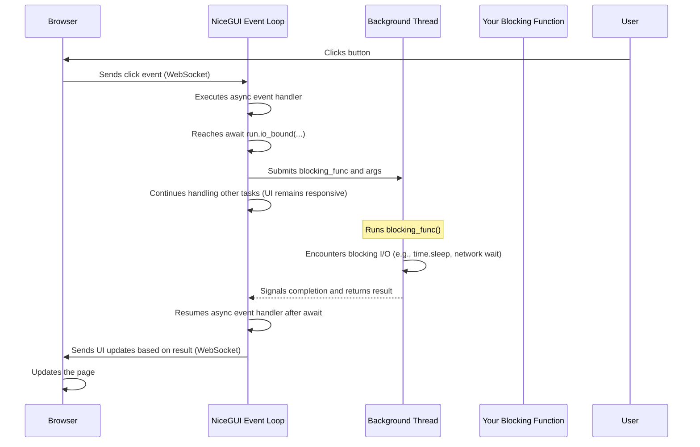

# Chapter 7: Concurrency and Background Tasks

Welcome back to the NiceGUI tutorial! In the previous chapters, you've built increasingly interactive applications. You learned about [App and Page Management](01_app_and_page_management_.md), adding [UI Elements](02_ui_elements_.md), arranging them with [Layout and Containers](03_layout_and_containers_.md), reacting to user actions with [Event Handling](04_event_handling_.md), and automatically syncing UI with data using [State Binding](05_state_binding_.md) and [Storage](06_storage_.md).

Your app can now display information, react to clicks and input, remember preferences, and keep the UI updated with data changes. But what happens if one of your event handlers needs to do something slow?

Imagine clicking a button that needs to:
*   Fetch data from a remote website (network request).
*   Process a large file from disk (disk I/O).
*   Perform a complex calculation or process an image (CPU-heavy task).

If you run these slow operations directly within the function connected to your button's `on_click`, your entire application will freeze. The user interface will become unresponsive – buttons won't react, inputs won't work, and animations will stop. This is because your NiceGUI application, by default, runs UI updates, event handling, and communication with the browser in a single main loop. If you block this loop with a long-running task, nothing else can happen.

This is where **Concurrency and Background Tasks** become essential. You need a way to "offload" these slow tasks so the main loop remains free to keep the UI responsive and handle user interactions.

### The Problem: Blocking the Event Loop

Let's see the problem in action with a simulated slow task. We'll use `time.sleep(5)` to pause execution for 5 seconds, simulating a blocking operation like waiting for a network request.

```python
from nicegui import ui
import time

def slow_blocking_task():
    print('Starting slow task...')
    time.sleep(5) # This blocks the entire application!
    print('Slow task finished.')

@ui.page('/')
def main_page():
    ui.label('Click the button to start a slow task.')
    ui.button('Start Blocking Task', on_click=slow_blocking_task)
    ui.label('I should update immediately after clicking, but I won't.')

ui.run()
```

Run this code, click the "Start Blocking Task" button, and try clicking it again or interacting with anything else. Notice how the page becomes completely unresponsive for about 5 seconds. The second label won't appear or update until `slow_blocking_task` finishes. This is bad user experience!

### The Solution: Async and Offloading with `run`

NiceGUI is built on top of `asyncio`, Python's library for writing concurrent code. This allows NiceGUI to manage many connections and UI updates efficiently. Your `@ui.page()` functions and event handlers are automatically treated as `async` functions, meaning they can use `await`.

`async` functions can cooperatively multitask. When an `async` function encounters an `await`, it can pause its execution, allow the event loop to do other things (like updating the UI or handling other events), and then resume later when the awaited operation is complete.

However, standard Python blocking calls (like `time.sleep()`, reading a file with `f.read()`, or most database/network libraries unless they are specifically built for `asyncio`) still block the entire event loop, even if they are inside an `async` function.

To solve this, NiceGUI provides the `run` object, specifically `run.io_bound` and `run.cpu_bound`. These functions are designed to take your standard, potentially blocking Python functions and run them in separate threads or processes, freeing up the main event loop.

You use `await` before calling `run.io_bound` or `run.cpu_bound` because they are asynchronous operations from the perspective of the main event loop – the main loop waits for them to *complete* (in their separate thread/process) but isn't blocked *while* they are running.

Here's the corrected version of the previous example, using `run.io_bound` with `await`:

```python
from nicegui import ui
import time
import asyncio # We need asyncio.sleep for async examples, but run.io_bound uses time.sleep

async def slow_async_task():
    print('Starting async task (simulating I/O)...')
    # Use run.io_bound for I/O-bound tasks (like time.sleep, network calls, file reads)
    await run.io_bound(time.sleep, 5) # Offload the blocking sleep to a thread
    print('Async task finished.')
    # You can update the UI *after* the await returns

@ui.page('/')
async def main_page(): # Page function needs to be async to use await
    ui.label('Click the button to start an async task.')
    # Event handler needs to be async or a lambda that calls an async function
    ui.button('Start Async Task', on_click=slow_async_task)
    ui.label('I should update immediately after clicking, and I will!')

ui.run()
```

Run this improved code. Click the "Start Async Task" button. Notice how the button visually reacts to the click immediately (e.g., changing state slightly), and you can interact with other parts of the page (if there were any). The page remains responsive because the `time.sleep(5)` call is no longer blocking the main event loop; it's happening in a separate thread managed by `run.io_bound`. The `async def slow_async_task` function pauses at `await run.io_bound(...)` until the separate thread finishes, then it resumes and the print statements before and after the `await` are executed.

This is the core pattern:
1.  Identify blocking code (network, disk I/O, heavy CPU).
2.  If the event handler containing the blocking code isn't already `async def`, make it so.
3.  Wrap the blocking function call with `await run.io_bound(...)` or `await run.cpu_bound(...)`.

### `run.io_bound(func, *args, **kwargs)`

*   **Use for:** Tasks that spend most of their time *waiting* for something external. Examples: Network requests (`requests.get(...)`, `urllib.urlopen(...)`), reading/writing files (`open(...).read()`, `json.dump(...)`), database operations using traditional blocking libraries.
*   **How it works:** NiceGUI runs the provided function `func` with the given `*args` and `**kwargs` in a separate **thread**. Threads are good for I/O because the Python Global Interpreter Lock (GIL) is released while the thread is waiting, allowing other threads (including the main event loop thread) to run.
*   **Requirement:** The function `func` itself should *not* be an `async def` function. It should be a regular Python function that contains blocking operations. The call to `run.io_bound` must be `await`ed from an `async def` context (like your event handler).
*   **Return Value:** `await run.io_bound(...)` returns whatever `func(*args, **kwargs)` returns.

Example using `requests` (requires `pip install requests`):

```python
from nicegui import ui, run
import requests

async def fetch_url_content(url: str):
    print(f'Fetching {url}...')
    try:
        # requests.get is a blocking I/O call, run it in a separate thread
        response = await run.io_bound(requests.get, url)
        content = response.text[:500] + '...' # Get first 500 chars
        print('Fetch finished.')
        # Update UI after the async operation is done
        result_label.set_text(f'Content from {url}:\n{content}')
    except Exception as e:
        print(f'Error fetching {url}: {e}')
        result_label.set_text(f'Could not fetch {url}: {e}')

@ui.page('/')
async def main_page():
    global result_label
    ui.label('Enter a URL to fetch its content:')
    url_input = ui.input('URL', value='https://example.com').classes('w-60')
    ui.button('Fetch Content', on_click=lambda: fetch_url_content(url_input.value))
    result_label = ui.label('Result will appear here.')\
        .classes('mt-4 whitespace-pre-wrap') # Keep line breaks

ui.run()
```

In this example, `requests.get(url)` is a blocking network call. By wrapping it in `await run.io_bound(...)`, we ensure that this waiting time doesn't freeze the NiceGUI event loop. The `fetch_url_content` function pauses at the `await`, and the main loop can continue. Once the `requests.get` call finishes in the background thread, the result is passed back, the `await` completes, and the code continues, updating `result_label`.

You can see `run.io_bound` used in `examples/opencv_webcam/main.py` to read frames from the webcam and in `examples/ai_interface/main.py` to read uploaded file content (`e.content.read()`) before passing it to an AI model prediction library.

### `run.cpu_bound(func, *args, **kwargs)`

*   **Use for:** Tasks that require significant CPU processing and *do not* involve much waiting. Examples: Heavy calculations, image processing using libraries like Pillow or OpenCV (if not using their async versions), complex data transformations, compressing/decompressing data.
*   **How it works:** NiceGUI runs the provided function `func` with the given `*args` and `**kwargs` in a separate **process**. Python's GIL prevents multiple threads from executing Python bytecode simultaneously on multiple CPU cores. For CPU-heavy tasks, threads still block each other. Processes bypass the GIL because each process has its own Python interpreter and memory space, allowing true parallel execution on multi-core processors.
*   **Requirement:** The function `func` must be picklable (can be sent to another process), should *not* be an `async def` function, and should not directly interact with NiceGUI UI elements (since they are in a different process). The call to `run.cpu_bound` must be `await`ed from an `async def` context.
*   **Return Value:** `await run.cpu_bound(...)` returns whatever `func(*args, **kwargs)` returns. The return value must also be picklable.

Example simulating a heavy calculation:

```python
from nicegui import ui, run
import time

def heavy_calculation(duration: int):
    print('Starting heavy calculation...')
    # Simulate intense CPU work (a loop is more CPU-bound than sleep)
    result = 0
    for i in range(duration * 1_000_000):
        result += i % 10
    print('Heavy calculation finished.')
    return result # Return a result

@ui.page('/')
async def main_page():
    global result_label
    ui.label('Click the button to start a heavy calculation.')
    ui.button('Start CPU Task', on_click=lambda: run_heavy_task(3)) # Calculate for 3 seconds worth of loops

    result_label = ui.label('Result: Pending...')

async def run_heavy_task(duration: int):
    result_label.set_text('Result: Calculating...')
    # Use run.cpu_bound for CPU-bound tasks
    final_result = await run.cpu_bound(heavy_calculation, duration) # Offload to a process
    result_label.set_text(f'Result: {final_result}') # Update UI with result after await

ui.run()
```

Run this code. Click the "Start CPU Task" button. The label changes to "Calculating..." immediately. The UI remains responsive. After the simulated heavy calculation finishes in the separate process, the `await` completes, and the main async function updates the label with the result.

You can see `run.cpu_bound` used in `examples/ffmpeg_extract_images/main.py` to run the FFmpeg subprocess (which is CPU-intensive) and in `examples/opencv_webcam/main.py` to convert OpenCV frames to JPEG (a CPU-intensive task). `examples/progress/main.py` and `examples/global_worker/main.py` also use `run.cpu_bound` for their background worker tasks.

### Updating UI from Background Tasks

A crucial point: **You generally cannot directly update NiceGUI UI elements from within the function that is running in a separate thread (`run.io_bound`) or process (`run.cpu_bound`)**.

Why? Because the UI elements and the main event loop that manages them reside in the *main* thread/process. Trying to access or modify them from another thread or process can lead to unpredictable behavior or crashes.

The recommended way to update the UI based on the result of a background task is:

1.  Have the background function (`func` in `run.io_bound(func,...)` or `run.cpu_bound(func,...)`) compute its result.
2.  Return the result from that function.
3.  The `await run.io_bound(...)` or `await run.cpu_bound(...)` call in your *main thread async function* will receive this result.
4.  Immediately *after* the `await` line (which means you are back in the main event loop context), use the received result to update your UI elements safely.

This is what we did in the examples above: we updated `result_label` only *after* the `await` call finished.

What about showing progress? For tasks that run for a long time and you want to show progress updates in the UI *while* they are still running in the background, simply returning a final result isn't enough. This is more complex and typically involves setting up a communication channel between the background worker and the main thread. Common ways include:

*   Using queues (like `multiprocessing.Queue` for `cpu_bound` tasks) where the background task puts progress updates, and a `ui.timer` in the main loop periodically checks the queue and updates the UI. (See `examples/progress/main.py` and `examples/global_worker/main.py`).
*   Using shared memory or other inter-process communication methods.

These methods are a bit more advanced and beyond the scope of a basic introduction, but the examples mentioned provide solid implementations you can adapt.

### How Concurrency Works (Under the Hood)

NiceGUI, built on FastAPI and Uvicorn, runs on an `asyncio` event loop in a single main thread. This loop is responsible for:

*   Listening for incoming HTTP requests (for initial page loads).
*   Managing WebSocket connections with connected browsers.
*   Receiving events from the browser (clicks, inputs, etc.) via WebSockets.
*   Executing your Python event handler functions.
*   Sending UI updates back to the browser via WebSockets.
*   Handling timers and other background `asyncio` tasks.

When you call a standard blocking function (like `time.sleep(5)`) directly in an event handler, even if the handler is `async def`, it *blocks* this single main thread. Nothing else on the list above can happen until the blocking function returns.

When you use `await run.io_bound(blocking_func, ...)`, NiceGUI:

1.  Takes `blocking_func` and its arguments.
2.  Submits them to a thread pool executor. This executor maintains a pool of background threads.
3.  One of the background threads runs `blocking_func`.
4.  Meanwhile, the main event loop, having encountered `await`, knows it can pause the current async function and switch to handling other events or running other tasks. It is *not* blocked.
5.  When the background thread finishes `blocking_func` and gets a result, it signals the main event loop.
6.  The main event loop receives the result and resumes the async function that was waiting at the `await run.io_bound(...)` call.
7.  The result is returned by the `await` expression, and your async function continues executing in the main thread.

When you use `await run.cpu_bound(cpu_intensive_func, ...)`, NiceGUI:

1.  Takes `cpu_intensive_func` and its arguments.
2.  Submits them to a process pool executor (using `multiprocessing`). This executor maintains a pool of background processes.
3.  One of the background processes runs `cpu_intensive_func`. This process has its own Python interpreter and memory, bypassing the GIL.
4.  Meanwhile, the main event loop, having encountered `await`, pauses the current async function and handles other tasks, remaining responsive.
5.  When the background process finishes `cpu_intensive_func` and gets a result, it sends the result back to the main process (often using inter-process communication mechanisms).
6.  The main event loop receives the result and resumes the async function that was waiting at the `await run.cpu_bound(...)` call.
7.  The result (which must be picklable) is returned by the `await` expression, and your async function continues executing in the main thread.

Here is a simplified sequence diagram illustrating the flow with `run.io_bound`:



This offloading mechanism is key to building high-performance NiceGUI applications that remain smooth and responsive even when dealing with slow or computationally expensive operations.

### Conclusion

You've now learned about Concurrency and Background Tasks in NiceGUI! You understand:

*   Why blocking the main event loop with slow tasks freezes your UI.
*   NiceGUI event handlers are `async` functions that can use `await`.
*   `run.io_bound(blocking_func, ...)` is used to run I/O-bound tasks in a separate thread, freeing the event loop while waiting.
*   `run.cpu_bound(blocking_func, ...)` is used to run CPU-bound tasks in a separate process, bypassing the GIL for true parallelism.
*   You must `await` calls to `run.io_bound` and `run.cpu_bound` from an `async def` function.
*   You cannot directly update UI elements from within the background function itself; update the UI *after* the `await` returns in your main async handler.
*   Under the hood, NiceGUI uses thread pools and process pools to manage these background tasks and communicate results back to the main event loop.

With these tools, you can perform demanding operations in your NiceGUI application without sacrificing user experience. You can now build apps that feel fast and responsive, even when they are doing heavy lifting behind the scenes.

As you build more complex applications, you might find that the standard UI elements provided by NiceGUI are not enough. You might want to create entirely new types of interactive components or integrate existing JavaScript libraries. This is the domain of **Custom Components**.

In the next chapter, we'll explore [Custom Components](08_custom_components_.md) and how to extend NiceGUI's capabilities by integrating your own frontend code.

[Next Chapter: Custom Components](08_custom_components_.md)

---

<sub><sup>Generated by [AI Codebase Knowledge Builder](https://github.com/The-Pocket/Tutorial-Codebase-Knowledge).</sup></sub> <sub><sup>**References**: [[1]](https://github.com/zauberzeug/nicegui/blob/fd25a94e12bc03e5852ae292ff5cd6ea84e4c804/examples/ai_interface/main.py), [[2]](https://github.com/zauberzeug/nicegui/blob/fd25a94e12bc03e5852ae292ff5cd6ea84e4c804/examples/ffmpeg_extract_images/main.py), [[3]](https://github.com/zauberzeug/nicegui/blob/fd25a94e12bc03e5852ae292ff5cd6ea84e4c804/examples/global_worker/main.py), [[4]](https://github.com/zauberzeug/nicegui/blob/fd25a94e12bc03e5852ae292ff5cd6ea84e4c804/examples/opencv_webcam/main.py), [[5]](https://github.com/zauberzeug/nicegui/blob/fd25a94e12bc03e5852ae292ff5cd6ea84e4c804/examples/progress/main.py), [[6]](https://github.com/zauberzeug/nicegui/blob/fd25a94e12bc03e5852ae292ff5cd6ea84e4c804/examples/script_executor/main.py)</sup></sub>