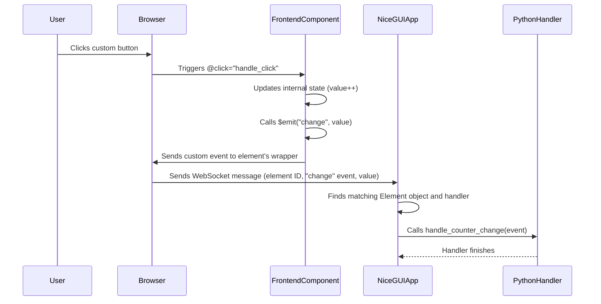
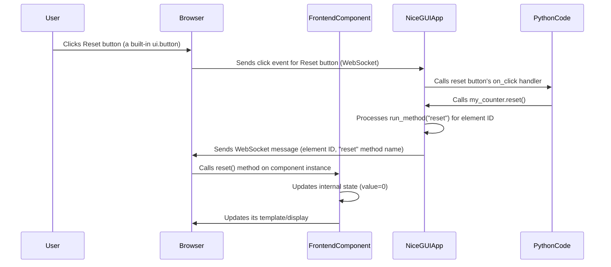

# Chapter 8: Custom Components

Welcome back to the NiceGUI tutorial! In the previous chapters, you've learned to build increasingly sophisticated applications: [App and Page Management](01_app_and_page_management_.md), creating [UI Elements](02_ui_elements_.md), arranging them with [Layout and Containers](03_layout_and_containers_.md), making them dynamic with [Event Handling](04_event_handling_.md), keeping UI and data in sync with [State Binding](05_state_binding_.md) and [Storage](06_storage_.md), and running long tasks without freezing the UI using [Concurrency and Background Tasks](07_concurrency_and_background_tasks_.md).

NiceGUI provides a rich set of built-in UI elements like buttons, labels, inputs, charts, and more, covering many common needs. However, there will inevitably be times when you need a specific UI widget or behavior that isn't included out-of-the-box.

Maybe you need to:
*   Integrate a specialized JavaScript library for, say, a signature pad, a complex data visualization, or a specific kind of input (like a color picker with advanced features).
*   Create a reusable, composite widget made of several basic elements with custom layout and internal logic.
*   Build a highly customized element with unique styling and animations.

When the built-in elements aren't quite right, NiceGUI allows you to extend its capabilities by creating your own **Custom Components**.

### What are Custom Components?

Custom components are your way of defining new UI elements using standard web technologies (specifically, Vue.js components and plain JavaScript) and seamlessly integrating them into your NiceGUI application, controlling them from Python.

It bridges the gap between your Python backend logic and the powerful, flexible world of frontend development. You define the component's appearance and interactive behavior in a frontend file, and then you create a simple Python class that acts as the handle for this component, allowing you to create, configure, and interact with it from your Python code just like any other `ui.` element.

### Our Goal: A Simple Click Counter Button

Let's create a minimal custom component as a concrete example: a button that displays a title and an internal counter, and increments the counter each time it's clicked. We'll make it slightly different from a regular `ui.button` by showing the count *inside* the button and having its background color change based on the count.

This component will need:
*   A visual representation (a button).
*   To display some text (a title).
*   To store an internal state (the counter).
*   To react to clicks (increment the counter).
*   To communicate its new value back to Python (optional, but good for demonstration).

We'll define this in two parts: the frontend code and the backend Python class.

### Part 1: The Frontend Code (.js or .vue)

The frontend code describes how the component looks and behaves in the user's browser. NiceGUI uses [Vue.js 3](https://vuejs.org/) components, but for simple cases, a single JavaScript file using Vue's Options API is enough.

Let's create a file named `counter.js` and put the following basic Vue component definition inside:

```javascript
// counter.js - The frontend definition of our custom component

export default {
  // Defines the HTML structure for the component
  template: `
    <button @click="handle_click">
      <strong>{{title}}: {{value}}</strong>
    </button>
  `,
  // Properties passed down from the Python side
  props: {
    title: String, // We expect a 'title' string from Python
  },
  // Internal state of the component
  data() {
    return {
      value: 0, // The click counter, starts at 0
    };
  },
  // Methods defining component behavior
  methods: {
    handle_click() {
      this.value += 1; // Increment the internal counter
      // Emit an event back to Python, sending the new value
      this.$emit("change", this.value);
    },
    // A method that Python can call (we'll see this later)
    reset() {
      this.value = 0;
    },
  },
};
```

Save this code as `counter.js` in the same directory as your Python file.

Let's break down this JavaScript code:

*   `export default { ... }`: This defines a standard Vue.js component object.
*   `template: \`...\``: This is the HTML structure of our component. It's just a `<button>`.
    *   `@click="handle_click"`: This is Vue syntax. It means "when this button is clicked, call the `handle_click` method defined below".
    *   `{{title}}` and `{{value}}`: These are Vue template expressions. They display the current values of the `title` property and the `value` data variable.
*   `props: { title: String }`: This declares that this component expects a `title` property from its parent (in our case, the NiceGUI element in Python). Vue ensures it's a string.
*   `data() { return { value: 0 }; }`: This defines the internal state of the component. `value` is initialized to 0. This `value` belongs to *each instance* of the counter component.
*   `methods: { handle_click() { ... }, reset() { ... } }`: This defines functions that the component can perform.
    *   `handle_click()`: Increments `this.value` (the component's internal counter).
    *   `this.$emit("change", this.value)`: This is how a frontend component sends an event *back* to NiceGUI (and thus your Python code). It emits a custom event named `"change"` and includes the new `this.value` as data with the event.
    *   `reset()`: Sets the internal `value` back to 0.

This file tells the browser how to create, display, and manage the internal state (`value`) and basic interaction (`handle_click`) for one instance of our custom button.

### Part 2: The Backend Python Class

Now, we need a Python class that NiceGUI can use to create and interact with our `counter.js` component. This class will inherit from `nicegui.element.Element`.

Create a Python file (e.g., `custom_elements.py`) and add the following class:

```python
# custom_elements.py - Python classes for our custom components
from typing import Callable, Optional

from nicegui.element import Element

class Counter(Element, component='counter.js'):
    # The 'component' parameter tells NiceGUI which frontend file to use

    def __init__(self, title: str = 'Counter', *, on_change: Optional[Callable] = None) -> None:
        # Initialize the base Element class
        super().__init__()

        # Pass the 'title' argument from Python to the frontend component as a 'prop'
        self._props['title'] = title

        # Register a Python function to be called when the frontend emits the 'change' event
        self.on('change', on_change)

    def reset(self) -> None:
        # Define a Python method to call the frontend 'reset' method
        self.run_method('reset')

```

Save this as `custom_elements.py` in the same directory.

Let's look at this Python code:

*   `class Counter(Element, component='counter.js'):`: We define a new Python class `Counter` that inherits from `Element`. The magic happens with `component='counter.js'`. This tells NiceGUI: "When someone creates a `Counter` object in Python, use the Vue component defined in the `counter.js` file to render it in the browser."
*   `__init__(self, title='Counter', *, on_change=None)`: The standard Python constructor.
    *   `super().__init__()`: Calls the constructor of the base `Element` class, which sets up the necessary internal structures for NiceGUI.
    *   `self._props['title'] = title`: This is how you pass data from Python to the frontend component's `props`. Anything you put in the `_props` dictionary on the Python element object will be sent to the corresponding Vue component in the browser as props. We are sending the `title` argument provided to the Python `Counter` constructor.
    *   `self.on('change', on_change)`: This registers an event handler. It tells NiceGUI: "When the frontend component (`counter.js`) emits a custom event named 'change' (which it does in its `handle_click` method), call the Python function provided as `on_change`." The data emitted with the event (the new `value`) will be available in the event arguments passed to the `on_change` function.
*   `reset(self) -> None`: We define a regular Python method `reset`.
    *   `self.run_method('reset')`: This is how you call a method defined in your frontend Vue component from Python. It tells NiceGUI: "Send a message to the browser instance of *this* component and tell it to execute its JavaScript method named `reset()`."

This Python class serves as the interface to our frontend component. It tells NiceGUI which frontend file to load, how to pass data to it, how to react to events from it, and which of its methods can be called from Python.

### Part 3: Using the Custom Component in Your App

Now we can use our new `Counter` component just like any other built-in NiceGUI element.

Create your main application file (e.g., `main.py`):

```python
# main.py - Using our custom component
from nicegui import ui
from custom_elements import Counter # Import our custom class

def handle_counter_change(event):
    # This function receives the 'change' event from the frontend
    # event.args contains the data emitted by $emit
    new_count = event.args
    print(f'Counter value changed to: {new_count}')

@ui.page('/')
def main_page():
    ui.label('Using our custom counter component:')

    # Create an instance of our custom Counter component
    # Pass the title prop and register the event handler
    my_counter = Counter('My Clicks', on_change=handle_counter_change)

    ui.label('...and a button to reset it:')

    # Create a button that calls the reset method of our custom component
    ui.button('Reset Counter', on_click=my_counter.reset)

ui.run()
```

Save this as `main.py` in the same directory as `counter.js` and `custom_elements.py`. Run it using `python main.py`.

When you open the page:
1.  NiceGUI loads your `main_page` function.
2.  When it sees `my_counter = Counter('My Clicks', ...)`, it creates a Python `Counter` object.
3.  Based on `component='counter.js'`, NiceGUI knows to load and render the `counter.js` component in the browser for this element.
4.  The Python `_props['title'] = 'My Clicks'` is sent to the browser, and the Vue component receives "My Clicks" as its `title` prop. The button renders as "My Clicks: 0".
5.  The Python `on('change', handle_counter_change)` registers the event handler.

Now, when you click the custom button:
1.  The frontend `handle_click` JavaScript method runs.
2.  It increments the internal `value`.
3.  It calls `this.$emit("change", this.value)`.
4.  This sends a message via WebSocket back to the NiceGUI server.
5.  NiceGUI receives the "change" event for the `my_counter` element.
6.  It calls the registered Python `handle_counter_change` function, passing the event data (the new count).
7.  Your Python function prints the new count to the terminal.

Clicking the "Reset Counter" button calls the Python `my_counter.reset()` method, which in turn sends a message to the browser to execute the frontend `reset()` method, setting the internal counter back to 0.

This simple example demonstrates the full loop: Python creating a custom element, passing data to the frontend, frontend managing its own state and handling interaction, frontend sending events back to Python, and Python calling methods on the frontend component.

### How Custom Components Work (Under the Hood)

Let's look at the communication flow when using custom components:

1.  **Startup:** When your NiceGUI application starts, it makes the files specified by `component='...'` and `dependencies=['...']` available to the web server.
2.  **Page Load:** When a user visits a page, your `@ui.page()` function runs in Python.
3.  **Creating Custom Element:** When your code calls `Counter(...)` (which is an instance of `ui.element`), NiceGUI creates a Python `Element` object. It notes the `component='counter.js'` and the initial `_props` (like `title`).
4.  **Sending Instructions to Browser:** NiceGUI sends instructions over the WebSocket to the user's browser. These instructions tell the browser: "For element ID `XYZ`, load and instantiate the Vue component from `/path/to/counter.js`, passing these initial `props` (`{'title': 'My Clicks'}`). Also, be ready to send back messages for events named 'change'."
5.  **Browser Renders Component:** The browser receives the instructions, fetches `counter.js`, creates a new Vue component instance, renders its `template` into the page, and sets up event listeners (`@click`).
6.  **User Interaction (Click):** The user clicks the custom button in the browser.
7.  **Frontend Method Runs:** The Vue component's `handle_click` JavaScript method executes. It updates its internal `value` data.
8.  **Frontend Emits Event:** The `this.$emit("change", this.value)` line runs in JavaScript.
9.  **Browser Sends Event Message:** The browser instance of the component sends a message back to the NiceGUI server via WebSocket. This message includes the element ID (`XYZ`), the event name (`'change'`), and the emitted data (the new `value`).
10. **Server Receives Event:** The NiceGUI server receives the WebSocket message.
11. **Finding Python Handler:** NiceGUI looks up the element ID and the event name ('change') to find the corresponding registered Python function (`handle_counter_change`).
12. **Executing Python Handler:** The Python `handle_counter_change` function is executed, receiving the event data.
13. **Python Calls Frontend Method (Reset):** When the "Reset Counter" button is clicked, the Python `my_counter.reset()` method is called.
14. **Python Sends Method Call Instruction:** The `self.run_method('reset')` line in Python tells NiceGUI: "Send a message to the browser instance of element `XYZ` and tell it to execute its JavaScript method named `reset`."
15. **Browser Executes Frontend Method:** The browser receives the message and executes the `reset()` method on the specified Vue component instance. The frontend updates its internal state and potentially its display based on the method's logic.

Here's a simplified sequence diagram focusing on the click-and-event flow:



And for the Python-to-Frontend method call (`run_method`):



This intricate dance between Python and JavaScript, orchestrated by NiceGUI over WebSockets, is what enables the creation of powerful, interactive custom components.

### More Examples and Possibilities

The simple counter is just the beginning. You can create components for much more complex tasks:

*   **Signature Pad:** The `examples/signature_pad/` shows integrating a signature pad library. The Python class wraps the library, and Python can call methods like `clear()` on the pad (using `run_method`).
*   **Audio Recorder:** The `examples/audio_recorder/` demonstrates creating a component that uses browser APIs (microphone access) and emits recorded audio data back to Python (using `$emit`).
*   **Vue Single File Components (`.vue`):** For more complex frontend components involving multiple HTML tags, CSS styles, and JavaScript logic, you can use Vue's Single File Components (SFCs), which live in `.vue` files (see `examples/custom_vue_component/on_off.vue` or `examples/audio_recorder/audio_recorder.vue`). You reference them using `component='filename.vue'`.
*   **Dependencies:** If your custom component relies on an external JavaScript library (like `signature_pad` in the example), you can tell NiceGUI to include it by adding it to the `dependencies` list in the Python class definition (e.g., `dependencies=['node_modules/signature_pad/dist/signature_pad.min.js']`). NiceGUI will ensure this script is loaded in the browser before your component.

Creating effective custom components often requires some familiarity with HTML, CSS, and Vue.js fundamentals. The official Vue.js documentation is an excellent resource for learning the frontend side.

### Conclusion

You've now learned about Custom Components in NiceGUI! You understand:

*   Custom components allow you to extend NiceGUI with your own UI elements using frontend web technologies (Vue.js/JavaScript).
*   You define the component's appearance, internal state, and behavior in a frontend `.js` or `.vue` file.
*   You create a corresponding Python class inheriting from `ui.element` and linking the frontend file via `component='...'`.
*   You pass data from Python to the frontend using the `_props` dictionary.
*   You receive events emitted by the frontend component (`$emit`) by registering handlers with the `.on()` method in Python.
*   You can call frontend methods from Python using `element.run_method('methodName')`.
*   NiceGUI orchestrates communication between the Python backend and the frontend component instance in the browser over WebSockets.
*   You can include external JavaScript dependencies using the `dependencies` list in the Python class.

Custom components provide a powerful escape hatch, enabling you to integrate virtually any frontend functionality into your NiceGUI application when the built-in elements aren't sufficient.

This chapter concludes our initial tutorial series covering the core concepts of NiceGUI. You now have a solid foundation for building interactive web applications: managing pages, adding elements, arranging layouts, handling events, managing state and storage, performing background tasks, and even creating your own custom UI pieces.

From here, you can dive deeper into the NiceGUI documentation, explore the extensive examples provided with the library, and start building more complex and feature-rich applications. Good luck!
---

---

<sub><sup>Generated by [AI Codebase Knowledge Builder](https://github.com/The-Pocket/Tutorial-Codebase-Knowledge).</sup></sub> <sub><sup>**References**: [[1]](https://github.com/zauberzeug/nicegui/blob/fd25a94e12bc03e5852ae292ff5cd6ea84e4c804/examples/audio_recorder/audio_recorder.py), [[2]](https://github.com/zauberzeug/nicegui/blob/fd25a94e12bc03e5852ae292ff5cd6ea84e4c804/examples/audio_recorder/audio_recorder.vue), [[3]](https://github.com/zauberzeug/nicegui/blob/fd25a94e12bc03e5852ae292ff5cd6ea84e4c804/examples/audio_recorder/main.py), [[4]](https://github.com/zauberzeug/nicegui/blob/fd25a94e12bc03e5852ae292ff5cd6ea84e4c804/examples/custom_vue_component/counter.js), [[5]](https://github.com/zauberzeug/nicegui/blob/fd25a94e12bc03e5852ae292ff5cd6ea84e4c804/examples/custom_vue_component/counter.py), [[6]](https://github.com/zauberzeug/nicegui/blob/fd25a94e12bc03e5852ae292ff5cd6ea84e4c804/examples/custom_vue_component/on_off.vue), [[7]](https://github.com/zauberzeug/nicegui/blob/fd25a94e12bc03e5852ae292ff5cd6ea84e4c804/examples/signature_pad/main.py), [[8]](https://github.com/zauberzeug/nicegui/blob/fd25a94e12bc03e5852ae292ff5cd6ea84e4c804/examples/signature_pad/signature_pad.js), [[9]](https://github.com/zauberzeug/nicegui/blob/fd25a94e12bc03e5852ae292ff5cd6ea84e4c804/examples/signature_pad/signature_pad.py)</sup></sub>